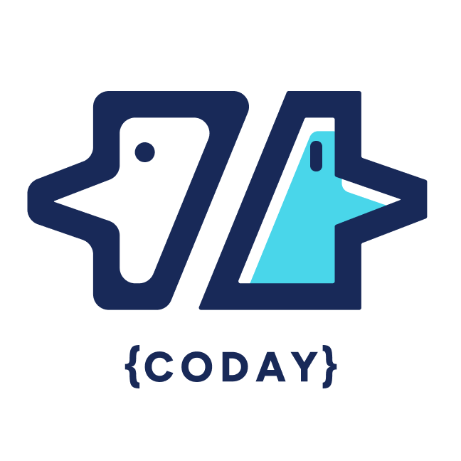

<div align="center">



# Coday

**A lightweight agentic framework**

[](LICENSE)
[](https://nodejs.org)

[Documentation](docs/README.md) • [Getting Started](docs/02-getting-started/installation.md) • [Configuration](docs/04-configuration/configuration-levels.md) • [GitHub](https://github.com/whoz-oss/coday)

</div>

---

## What is Coday?

Coday is a **conversation-based agentic framework** that helps developers work with AI agents on existing projects. It provides natural language interaction with AI through a web interface, supporting multiple AI providers (OpenAI, Anthropic, etc.) and extensive customization.

### Key Features

✨ **Web Interface** - Modern browser-based interface with rich formatting  
🤖 **Custom Agents** - Define specialized agents for your project's needs  
🔌 **Provider Agnostic** - OpenAI, Anthropic, or any compatible AI provider  
🛠️ **Extensible Tools** - Built-in tools plus MCP (Model Context Protocol) integrations  
💾 **Memory System** - Persistent context and knowledge across conversations  
📁 **Project-Scoped** - Configuration and context tied to your codebase  
🎯 **Webhook Support** - Programmatic API for external integrations

## Quick Start

### Prerequisites

- Node.js 22+ 
- npm (comes with Node.js)
- ripgrep (to install through `brew install ripgrep`)
- (have `ANTHROPIC_API_KEY` and/or `OPENAI_API_KEY` as env vars)

That's it!

### Launch Coday

```bash
  npx --yes @whoz-oss/coday-web
```

This command will:
1. Download the latest version (if needed)
2. Start the web server
3. Open your browser at `http://localhost:3000`
4. Run from the directory you were at

**📖 For detailed setup instructions**, see [Installation Guide](docs/02-getting-started/installation.md).

## First Steps

1. **Launch Coday** - Run `npx --yes @whoz-oss/coday-web`
2. **Create/Select Project** - Point Coday to your project directory
3. **Configure AI Provider** - Add your OpenAI or Anthropic API key
4. **Start Conversation** - Type your first message to an agent

**📖 Complete walkthrough**: [Your First Conversation](docs/02-getting-started/first-conversation.md)

## Documentation

### 🚀 Getting Started
- [Introduction](docs/01-introduction/introduction.md) - What is Coday and how to think about it
- [Installation](docs/02-getting-started/installation.md)
- [Launching Coday](docs/02-getting-started/launching.md)
- [First Conversation](docs/02-getting-started/first-conversation.md)

### 💻 Using Coday
- [Interface Basics](docs/03-using-coday/interface-basics.md)
- [Working with Agents](docs/03-using-coday/working-with-agents.md)
- [Conversation Management](docs/03-using-coday/conversation-management.md)

### ⚙️ Configuration
- [Configuration Levels](docs/04-configuration/configuration-levels.md)
- [User Configuration](docs/04-configuration/user-config.md)
- [Project Configuration](docs/04-configuration/project-config.md)
- [Agent Configuration](docs/04-configuration/agents.md)
- [MCP Integrations](docs/04-configuration/mcp-integrations.md)

### 🎯 Working Effectively
- [Prompting Strategies](docs/05-working-effectively/prompting-strategies.md)
- [Context and Memory](docs/05-working-effectively/context-and-memory.md)
- [Detecting Hallucinations](docs/05-working-effectively/detecting-hallucinations.md)
- [Iterative Workflows](docs/05-working-effectively/iterative-workflows.md)
- [Agent Design](docs/05-working-effectively/agent-design.md)
- [Agent Tooling](docs/05-working-effectively/agent-tooling.md)

### 🆘 Help
- [Troubleshooting](docs/troubleshooting.md)
- [Architecture](doc/ARCHITECTURE.md) (technical)
- [Development Workflow](doc/DEV_WORKFLOW.md) (contributors)

## Configuration Example

Create a `coday.yaml` in your project root:

```yaml
description: |
  Brief description of your project for AI context.

ai:
  - name: anthropic
    apiKey: sk-**ABCD
  - name: openai
    apiKey: sk-**EFGH    

agents:
  - name: backend-expert
    description: backend specialist
    instructions: |
      You specialize in backend development.
      Focus on API design, database optimization, and performance.
```

**📖 See [Project Configuration](docs/04-configuration/project-config.md) for complete guide.**

### Contributing

We welcome contributions! Please see:
- [Development Workflow](doc/DEV_WORKFLOW.md) - Contribution guidelines
- [Architecture](doc/ARCHITECTURE.md) - System architecture

### Release Process

Releases are automated via GitHub Actions based on conventional commits. See [Automated Release Process](doc/AUTOMATED_RELEASE.md) for details.

## Supported AI Providers

- ✅ OpenAI (GPT-4, GPT-4o, etc.)
- ✅ Anthropic (Claude 3.5 Sonnet, etc.)
- ✅ Any OpenAI-compatible API

## License

MIT License - see [LICENSE](LICENSE) file for details.

