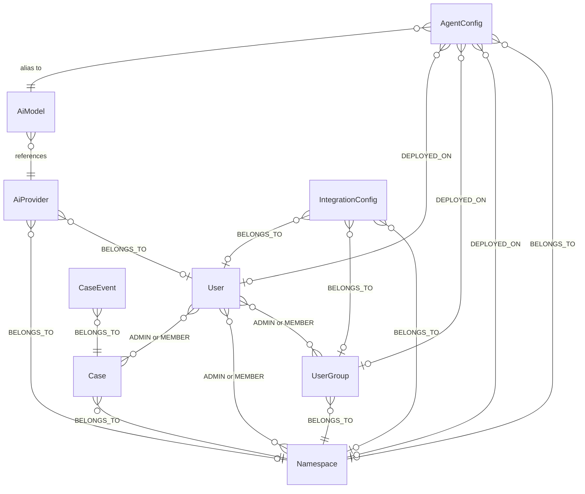
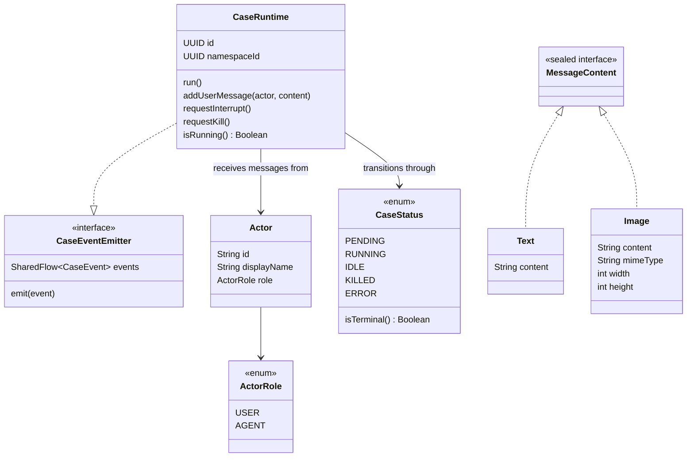

# AgentOS — Entity Schema

## Domain Entities & Relationships

> **Legend**
> - `o{`: 0..2+
> - `|{`: 1..2+
> - `||`: only 1
> - `o|`: 0..1
>
> "ADMIN or MEMBER" is an **exclusive** or: a user holds at most ONE of the two edges per
> entity (the relation is a role — role changes swap the edge type, they never stack edges,
> see `PermissionRelation`). ADMIN supersedes MEMBER: membership reads traverse `[:ADMIN|MEMBER]`.

> `AiProvider`, `AiModel`, and `IntegrationConfig` can each be scoped to a `Namespace`, a `User`,
> or both — this is the **triple-mode** `(namespaceId?, userId?)`.
>
> **Triple-mode invariant**: `(namespaceId IS NOT NULL) OR (userId IS NOT NULL)`.
> A row must always have at least one of the two set. The four legal combinations are:
>
> | `namespaceId` | `userId` | Interpretation |
> |---|---|---|
> | `N` | `null` | Namespace-shared (default, visible to all namespace members) |
> | `null` | `U` | User-global (applies for user U in every namespace) |
> | `N` | `U` | User × namespace (highest priority, only in namespace N for user U) |
> | `null` | `null` | ❌ Invalid — rejected at creation time |
>
> **User-level overlays**: when user `U` runs an agent in namespace `N`, the
> `ConfigMergeService` folds the three layers (namespace-shared → user-global →
> user×namespace) field-by-field to produce the effective runtime config. Namespace-scope list
> endpoints (`GET /api/integration-configs/by-parentId/{N}`, etc.) only return the
> `userId IS NULL` rows — user overlays are private.
>
> See [user-level-overlays.md](../user-level-overlays.md) for the full reconciliation pattern.
>
> `AgentConfig.published` gates availability: an unpublished agent cannot be assigned to any `UserGroup` and is never orchestrated.
>
> Access rule (planned): a `User` can use an `AgentConfig` only if the agent is published **and** associated to a `UserGroup` the user belongs to. Membership in a `Namespace` alone does not grant access to its agents.
>
> Open question: can a `User` be in a `UserGroup` without being a `MEMBER` of the parent `Namespace`?

---

## Runtime Concepts (non-persisted)

