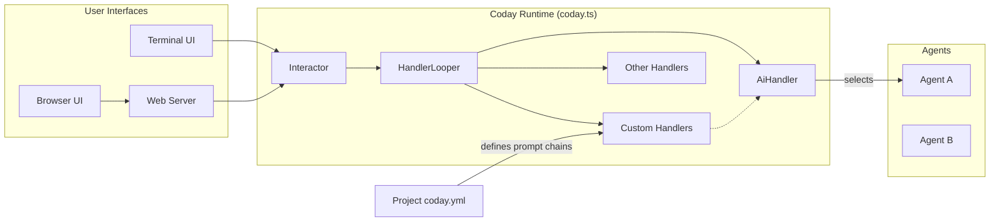
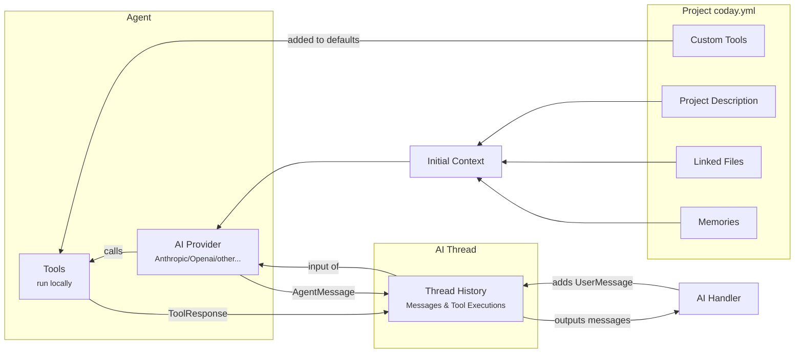

# Architecture Overview

## Request Flow

The user request flows through Coday's components:

1. The User Interface components is connecting to an `Interactor` that exposes downstream the interactions with the user.
2. The `HandlerLooper` is charged to identify the correct handler to take the user request among several ones. The last one being the `AiHandler` that directs the request to an agent. Once handled, the 
3. The selected `Agent` has through its supporting `AiClient` a loop of its own so the agent can come to a final answer after possibly many intermediate messages and tool calls (that can be nested agent calls).

## Agent Operation

An AI agent processes a request using various data sources and tools:

The agent operation demonstrates how requests are processed within an agent:

1. Context Building:
   - Project configuration provides description, files, and memories
   - These form the initial context for the AI provider
   - Custom tools are added to the default toolset

2. Message Processing:
   - AI Handler adds user messages to the thread history
   - Thread history provides full context to the AI provider
   - AI provider can generate messages and use tools
   - Tool responses and agent messages are recorded in history
   - History outputs messages back to the AI Handler

3. Tool Execution:
   - Tools run locally in the system
   - Each tool execution is recorded in history
   - AI provider can make multiple tool calls
   - Results influence further agent responses
