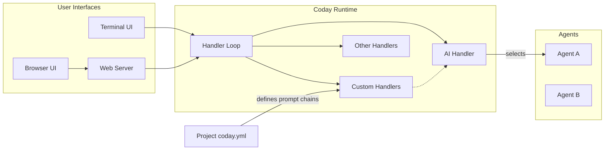
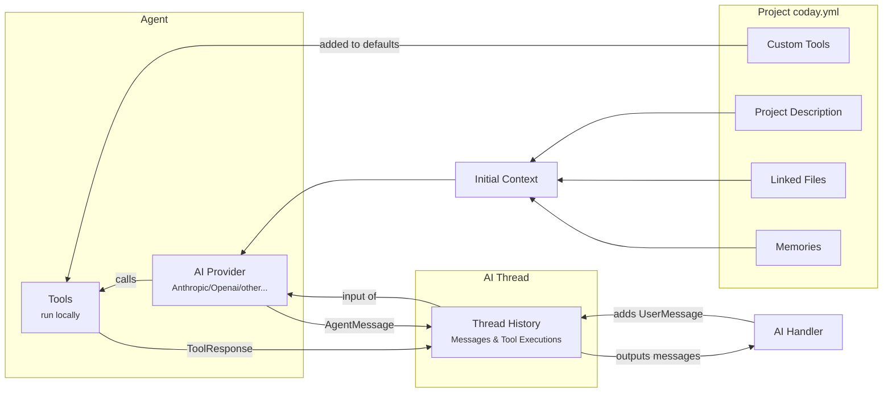

# Architecture Overview

## Request Flow

The following diagram shows how a user request flows through Coday's components:

## Agent Operation

This diagram illustrates how an AI agent processes a request using various data sources and tools:

The request flow shows how user input from different interfaces is processed through the system:

1. Users can interact through Terminal or Browser interfaces
2. The Handler Loop processes all requests, routing them appropriately
3. Custom handlers, defined in the project configuration, can extend functionality
4. The AI Handler manages agent selection and interaction
5. Multiple agents are available for different processing needs

The agent operation demonstrates how requests are processed within an agent:

1. Context Building:
   - Project configuration provides description, files, and memories
   - These form the initial context for the AI provider
   - Custom tools are added to the default toolset

2. Message Processing:
   - AI Handler adds user messages to the thread history
   - Thread history provides full context to the AI provider
   - AI provider can generate messages and use tools
   - Tool responses and agent messages are recorded in history
   - History outputs messages back to the AI Handler

3. Tool Execution:
   - Tools run locally in the system
   - Each tool execution is recorded in history
   - AI provider can make multiple tool calls
   - Results influence further agent responses

This architecture enables:

- Multiple interface options while maintaining consistent processing
- Extensible functionality through custom handlers
- Context-aware AI processing with memory
- Local tool execution with history tracking
- Multiple AI provider support on a same conversation