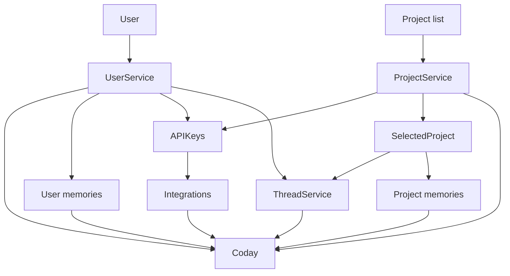

# Multi-user config

Current config does not support multi user, all is tied to the os.userInfo = technical user running the application

Changes needed to cover 3 situations:

- terminal: still os.userInfo
- local web: take the username from a header put by the frontend
- server web: still the header, but have it written by the auth middleware

## Service hierarchy

1. configService needs to take options to select the right folder and expose the users and projects
2. userService takes the users path, selects or create user if unknown, handles updates in user config
3. projectService takes the projects path, expose the selection, list, edit capabilities

All these services are to be injected in the Coday runtime by the start point (terminal or web).

Coday needs:

- a User (or UserService ?): exposes the selected user info (username) and supports the user configuration methods (manage AI-integration and API keys or credentials)
- a ProjectService: exposes a nullable selectedProject, supports selection of a project, creation, list, removal
- a ThreadService: depends on User and ProjectService to expose a nullable selectedThread, supports selection, creation, list, removal.
- an IntegrationService: depends on User and ProjectService

## Moving integration configs

Configs are on the project, so shared for all users. That is unwanted, at least for the apikey or token.

### Per user

If `user.integrations` is holding the integrations currently on the project, it applies to all projects visited by the user. Not wanted.

### Per user, per project

If `user.projects[projectName]` then the integration is applied only to the selected project, much better but not flexible enough ?

### Per user, optional projectName

If `user.integrations` is a list of integrations with a project property, we can filter them and have them applicable to one project or many. But duplication to handle in that case between an integration at User, User&Project and Project level

### Summary

Most interesting option is to have a hierarchy of integration configs, each priority level masking the values of the following one:

1. User: highest priority, ideal for apikeys
2. Project: shared for all users, ideal for setting apiUrl, should discourage setting apikeys and username
3. User all projects: shared for all projects, ideal for username (and/or apiKeys) => to forget ?

Web usage:

- Project level to declare the integrations
- UserProject level to fill the username/apiKeys

Local usage:

- User level to set integrations for all projects ?
- override on a per-project level

Important: distinguish the enabling of the integration, Project level, from the configuration, either at Project or UserProject or User level. Ex in handlers : `config edit-integration` => asks to select User or Project level

- `User` level is implicitly for User and Project
- `Project` level should have a warning

## Scale

Later integrations:

- technical account on the platform = apikey at project level
- user-identity use 
  - with apikey at User level, implies per user config.
  - with Oauth flow => no more setup, auth on tool use, ideal in the future ?

## 