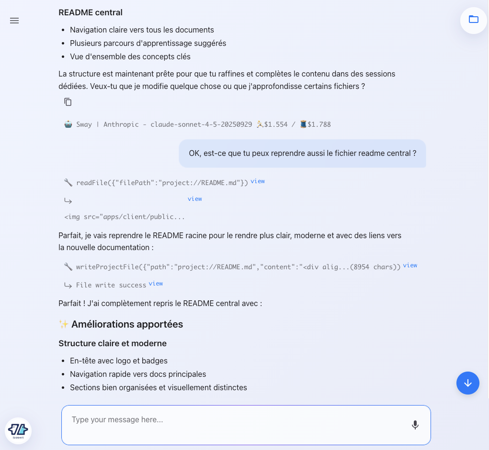

# Mental Model

Before diving into using Coday, it's important to understand how to think about working with AI agents in this framework.

## Conversation as the Interface

Unlike traditional development tools with menus and buttons, Coday is fundamentally **conversation-based**. You interact with agents through natural language, explaining what you want, asking questions, and iterating on solutions together.

## Agents as Specialized Collaborators

Think of agents not as generic chatbots, but as specialized team members:
- Each agent has a specific role (e.g., software developer, architect, product manager)
- Agents have access to project context, documentation, and tools
- Different agents may approach the same problem differently based on their configuration
- Agents can be organized in a hierarchy to tackle more complex tasks

## Context is Everything

Agents operate within the context of:
- **Your project**: Code, structure, configuration
- **Conversation history**: Previous messages and decisions
- **Memories**: Important facts stored for future reference
- **Available tools**: What actions the agent can take

The more relevant context an agent has, the better its responses.

## Iterative Collaboration

Working with Coday is iterative:
1. You describe what you want
2. The agent analyzes, asks clarifying questions, or proposes solutions
3. You provide feedback, adjust direction, or accept the proposal
4. Repeat until the task is complete

This is not about getting perfect answers on the first try—it's about guiding the agent toward the right solution through dialogue.

## Autonomy vs Control

Coday offers a spectrum from full control to full autonomy:
- **Guided**: You review every step before execution
- **Semi-autonomous**: Agent executes common tasks, asks for complex decisions
- **Autonomous**: Agent works independently toward a goal

You choose the level based on the task complexity and your comfort level.

## Next Steps

Now that you understand how to think about Coday, you're ready to [get started](../02-getting-started/installation.md).
