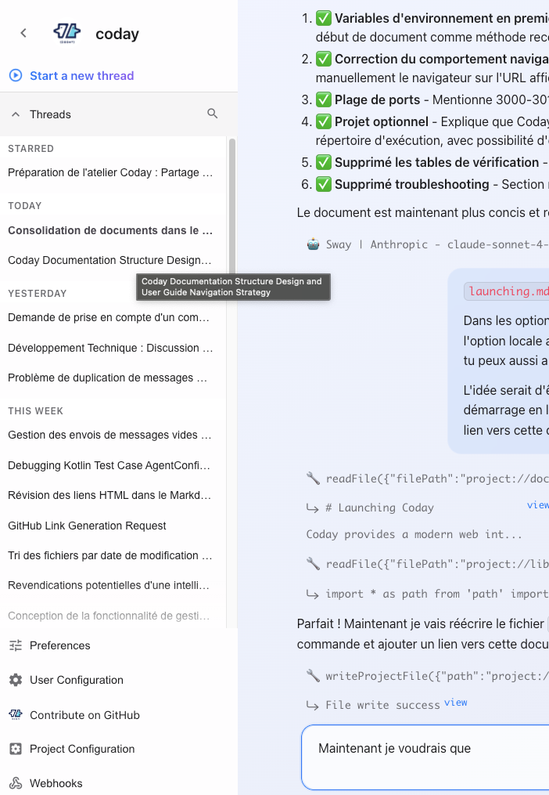

# Conversation Management

As conversations grow, managing context and narrative becomes important. This guide covers techniques for keeping conversations focused and effective.

## Understanding Threads

In Coday, conversations are organized into **threads**. Each thread is an independent conversation with:
- Its own message history
- Separate context
- Independent narrative flow

Threads appear in the sidebar, organized by time:
- **STARRED** - Important threads you've marked
- **TODAY** - Today's conversations
- **YESTERDAY** - Previous day
- **THIS WEEK** - Recent threads
- Older threads by date



## Understanding Conversation State

Every conversation (thread) has:
- **Message history**: All previous exchanges in this thread
- **Context window**: The amount of history the AI can "see" (limited by model)
- **Narrative thread**: The logical flow of the discussion

As conversations grow longer, older messages may fall outside the context window, potentially losing important context.

## When to Manage Conversations

Consider intervention when:
- The conversation becomes unfocused or meandering
- The agent seems to have forgotten earlier decisions
- You're starting a significantly different task
- The agent is repeating itself or seems confused
- The thread has become too long or complex

## Conversation Management Techniques

### 1. Continuing the Current Thread

**Best for**: Related follow-ups, iterative refinement

Simply continue the conversation. The agent maintains context from recent messages:

```
You: Add error handling to the login function
Agent: [Implements error handling...]

You: Now add logging for failed attempts
Agent: [Adds logging, aware of previous changes...]
```

**When to use**: 
- Sequential tasks that build on each other
- Iterative refinement of a solution
- Related questions about the same topic

### 2. Starting a New Thread

**Best for**: Unrelated tasks, fresh start

Click **"Start a new thread"** in the sidebar when:
- Beginning an unrelated task
- The current thread is too long and losing focus
- You want a clean slate without previous context
- Switching to a completely different topic

**Benefits**:
- Clean context for new tasks
- Easier to find specific conversations later
- Prevents context pollution
- Keeps threads focused and manageable

**Example scenarios**:
- Current thread: "Implementing authentication"
- New thread: "Adding email notifications" (unrelated feature)

### 3. Guiding the Narrative

**Best for**: Refocusing without losing context

Explicitly redirect the conversation within the same thread:

```
You: Let's step back. We've implemented the login feature, but before moving on, 
     let's review the security implications.
```

This keeps history but reframes the current focus.

**Techniques**:
- Summarize what's been done
- Explicitly state the new direction
- Reference previous decisions before pivoting
- Use transitional phrases ("Now let's...", "Before moving on...")

### 4. Truncating the Thread

**Best for**: Removing irrelevant or incorrect paths

Delete messages that led down unproductive paths. In the web interface:
1. Hover over the message where things went wrong
2. Click the delete button (🗑️)
3. Confirm the deletion

This removes that message and all subsequent ones, allowing you to restart from a better point.

**Use cases**:
- The agent misunderstood and went in the wrong direction
- You explored an approach that didn't work out
- Earlier messages contain outdated or incorrect information
- The conversation went in circles

**Example**:
```
Message 5: "Let's try approach A"
Message 6-10: [Agent explores approach A, doesn't work]
→ Delete from message 5
Message 5 (new): "Let's try approach B instead"
```

### 5. Using Memories

**Best for**: Preserving important context across threads

Store critical information in memories so it persists:

```
memory add "We decided to use JWT tokens with 24h expiration for authentication"
```

Memories are accessible to agents across all threads and even after truncation. See [Context and Memory](../05-working-effectively/context-and-memory.md) for details.

## Thread Organization

### Starring Important Threads

Mark threads you want to keep accessible:
1. Open the thread
2. Click the star icon
3. Find it later in the **STARRED** section

**Star threads that**:
- Contain important decisions
- You reference frequently
- Document complex implementations
- Serve as examples or templates

### Searching Threads

Use the search icon (🔍) in the sidebar to find threads by:
- Thread title
- Message content
- Date range
- Agent used

### Naming Threads

Give threads descriptive names to find them easily later. The first message often becomes the thread title, so start with a clear summary:

```
✅ Good: "Implement OAuth2 authentication with Google"
❌ Poor: "Hey, can you help me?"
```

## Best Practices

### Keep Context Relevant

Regularly summarize or clarify:
```
You: To summarize: we've decided on JWT tokens for auth, implemented the login 
     endpoint, and added rate limiting. Now let's tackle session management.
```

This helps both you and the agent stay aligned.

### Detect When to Truncate

Signs you should truncate:
- Agent references outdated information
- Responses become generic or repetitive
- Agent asks questions already answered
- The conversation has gone in circles
- You realize you went down the wrong path

**Don't wait too long** - truncate early to avoid wasting time.

### Strategic Checkpoints

Create natural checkpoints in long conversations:
```
You: Before we continue, let's document what we've decided so far...
Agent: [Summarizes decisions...]

You: Perfect. Now for the next phase...
```

This creates a reference point you can return to if needed.

### Thread vs Memory

**Use threads for**:
- Specific tasks or features
- Exploratory conversations
- Temporary context

**Use memories for**:
- Architectural decisions
- Project conventions
- Important patterns
- Long-term knowledge

## Managing Long Projects

For complex projects spanning multiple sessions:

1. **Create a main planning thread**: Document overall architecture and decisions
2. **Star it** for easy access
3. **Create feature-specific threads**: One thread per major feature
4. **Use memories**: Store cross-cutting decisions
5. **Reference previous threads**: "As we discussed in the authentication thread..."

## Common Patterns

### Exploration → Implementation
```
Thread 1: "Explore authentication options"
→ Research, discuss approaches
→ Make decision, store in memory

Thread 2: "Implement JWT authentication"
→ Implementation based on decision
→ Reference memory from previous thread
```

### Review → Refactor
```
Same thread:
1. Initial implementation
2. Review and feedback
3. Refactor based on feedback
→ Keep in one thread for full context
```

### Debug → Fix
```
Thread 1: "Login endpoint returning 500"
→ Debugging, exploring causes
→ Identify root cause

Thread 2: "Fix authentication validation"
→ Clean implementation of fix
→ Reference findings from debug thread
```

## Tips

1. **Don't over-manage**: Let conversations flow naturally when they're productive
2. **Truncate early**: Better to cut a wrong path short than let it continue
3. **Document decisions**: Explicitly state conclusions before moving on
4. **Use memories**: Store important facts that should persist
5. **Reset guilt-free**: Starting fresh is often faster than fixing a derailed conversation
6. **Star liberally**: Better to have too many starred threads than lose important ones
7. **Search often**: Don't recreate work - find and reference previous threads
8. **One topic per thread**: Resist the urge to add unrelated tasks to active threads

## Next Steps

Now that you understand conversation management, learn about [configuration](../04-configuration/configuration-levels.md) to customize Coday for your needs.
