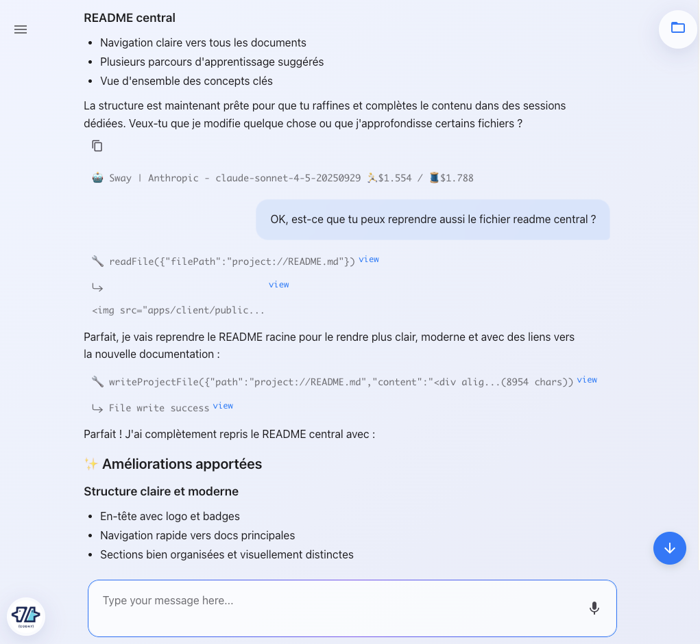

# Interface Basics

This guide covers the essential interface elements and navigation in Coday's web interface.

## Web Interface Layout



The Coday web interface consists of three main areas:

### 1. Sidebar (Left Panel)


The sidebar provides navigation and quick access to:

- **Start a new thread** button - Create a new conversation
- **Threads list** - Organized by time:
  - **STARRED** - Threads you've marked as important
  - **TODAY** - Today's conversations
  - **YESTERDAY** - Previous day's threads
  - **THIS WEEK** - Recent threads from the current week
  - Older threads organized by date
- **Search** - Find specific threads (🔍 icon)
- **Configuration menu** (bottom):
  - ⚙️ **Preferences** - Interface settings (voice, keyboard, theme)
  - 👤 **User Configuration** - AI providers, personal settings
  - 📁 **Project Configuration** - Project-specific settings
  - 🔗 **Webhooks** - External integrations
  - 🐙 **Contribute on GitHub** - Link to repository

**Toggle sidebar**: Click the hamburger menu (☰) in the top-left corner.

### 2. Conversation Area (Center)

The main area displays:
- **Thread title** at the top
- **Message history** with rich formatting:
  - User messages (your input)
  - Agent responses with markdown rendering
  - Tool usage indicators (e.g., `readFile`, `writeProjectFile`)
  - Code blocks with syntax highlighting
  - Images and visual content
- **Agent/Model info** - Shows which agent and AI model is being used
- **Token usage** - Displays input/output token counts

### 3. Input Area (Bottom)

- **Text input field** - Type your messages here
- **Voice input** - 🎤 Microphone icon for speech-to-text
- **Scroll to bottom** - Floating button (⬇️) appears when scrolled up

## Key Features

### Rich Text Formatting

Messages support full markdown:
- **Bold**, *italic*, `code`
- Code blocks with syntax highlighting
- Lists, quotes, links
- Headers and formatting

### Image Support

**Drag and drop** images directly into the input area to include them in your conversation. Useful for:
- Screenshots of errors
- Diagrams and mockups
- Visual references

### Exchange Space (File Sharing)

The **Exchange Space** provides a dedicated area for sharing files with the agent during conversations.

**Access**: Click the **📁 folder icon** in the thread header to open the file drawer.

#### File List
- View all files shared in the current thread
- See file name, size, and last modified date
- Download all files at once with the **download all** button

#### Supported Actions
- **👁️ View** - Display file content inline (text-based files only)
- **⬇️ Download** - Download file to your computer
- **🗑️ Delete** - Remove file from exchange space

#### Uploading Files
Drag and drop files into the exchange space or use the upload button to share:
- Documents (`.txt`, `.md`, `.json`, `.yaml`)
- Code files
- Configuration files
- Any text-based content up to 20 MB

**Note**: Images are handled differently - drop them directly in the chat input to include them in your message.

#### Viewing Files
Click the **👁️ view icon** on supported file types to see content inline:
- **Markdown** (`.md`) - Rendered with formatting
- **JSON** (`.json`) - Formatted with proper indentation
- **YAML** (`.yaml`, `.yml`) - Displayed in monospace
- **HTML** (`.html`, `.htm`) - Rendered in a secure sandbox
- **Text** - Plain text display

Files larger than 20 MB or binary formats (PDFs, images) can only be downloaded.

#### Use Cases
- Share configuration files for the agent to analyze
- Upload code snippets for review
- Provide context documents (specs, requirements)
- Exchange data files (JSON, YAML)
- Share HTML previews or reports

The agent can read files from the exchange space using the `readFile` tool, making it easy to reference shared content throughout the conversation.

### Voice Input

Click the **🎤 microphone icon** to use speech-to-text:
1. Click and hold the icon to start recording
2. Speak your message
3. Check for any typos or mis-spells

Configure your preferred language in **Preferences**.

⚠️ Make sure to select the right microphone in the browser (permissions/microphone selection)

👉 Use also the OS speech-to-text native accessibility feature

### Voice Output

Agent responses can be read aloud:
- Click the **▶️ play button** next to any agent message
- Configure voice settings in **Preferences**

### Theme Selection

Choose your preferred visual theme in **Preferences**:
- **Light** - Bright interface
- **Dark** - Dark mode
- **System** - Follows your OS theme

## Common Actions

### Starting a New Thread
1. Click **"Start a new thread"** in the sidebar, or
2. Use the keyboard shortcut (if configured)

Each thread is an independent conversation with its own context.

### Sending Messages

Type your message and press:
- **Enter** - Send message (default, or configure in Preferences)
- **Cmd/Ctrl+Enter** - Send message (alternative, configurable)
- **Shift+Enter** - New line (always)

Configure Enter key behavior in **Preferences** → "Enter to send".

### Stopping Agent Execution

When an agent is processing:
- Click the **Stop** button that appears during execution
- This immediately halts the current operation

### Deleting Messages

To remove a message and all subsequent messages:
1. Hover over the message
2. Click the delete button (🗑️)
3. Confirm the deletion

This is useful for:
- Removing incorrect or irrelevant exchanges
- Restarting from a better point in the conversation
- Cleaning up exploratory paths that didn't work

### Searching Threads

Use the search icon (🔍) in the sidebar to find specific threads by:
- Thread title
- Message content
- Date range

### Starring Important Threads

Mark threads as important to keep them easily accessible:
1. Open the thread
2. Click the star icon
3. Find it later in the **STARRED** section

## Accessing Commands

Type commands directly in the chat input:

```
config ai list          # List AI providers
help                    # Show available commands
memory list             # Show stored memories
config mcp list         # List MCP integrations
```

Type `help` to see all available commands and their syntax.

## Preferences

Access **Preferences** from the sidebar menu to configure:

### Voice Settings
- **Input language** - Language for speech-to-text
- **Output voice** - Voice for text-to-speech
- **Voice speed and pitch** - Adjust playback

### Keyboard Shortcuts
- **Enter behavior** - Choose between "Enter to send" or "Enter for new line"

### Visual Settings
- **Theme** - Light, dark, or system
- **Font size** - Adjust readability

### AI Provider Settings
Access through **User Configuration** to manage:
- API keys
- Default models
- Provider-specific settings

## Tips

- **Use markdown** in your messages for better formatting
- **Upload images** when visual context helps (diagrams, screenshots, errors)
- **Use voice input** for longer explanations or hands-free operation
- **Star important threads** to keep them easily accessible
- **Search frequently** to find past conversations and decisions
- **Delete freely** - remove wrong paths to keep conversations focused

## Next Steps

Learn how to effectively [work with agents](./working-with-agents.md) and manage your conversations.
