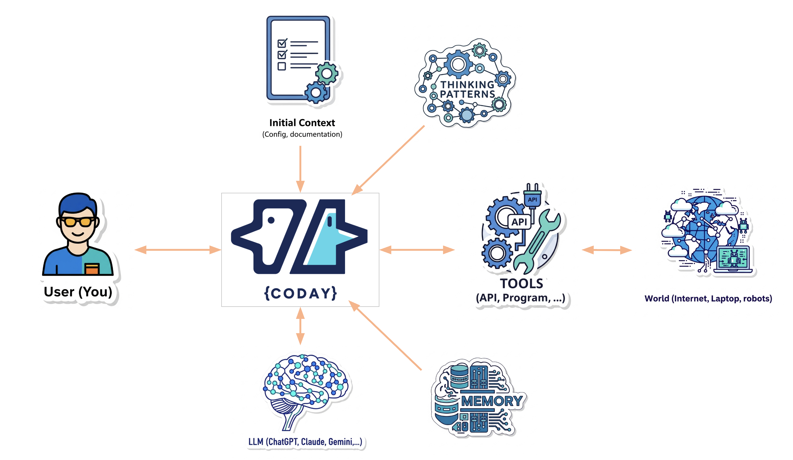

# Working with Agents

Agents are the core of Coday. This guide explains how to effectively interact with and switch between different agents based on the actual implementation.

## Understanding Agents



Each agent in Coday has:
- A **name** (e.g., `sway`, `archay`, `pm`) - case insensitive
- A **description** - short explanation of the agent's purpose
- **System instructions** - the prompt that defines its behavior and expertise
- **Access to tools** (ToolSet) - for interacting with your project
- **Connection to an AI client** - via a configured AI provider (Anthropic, OpenAI, etc.)
- Optional **documentation** - mandatory and optional docs loaded into context

Agents are defined in:
1. Your project's `coday.yaml` file (agents section)
2. Project local configuration (per-user overrides)
3. Agent files in `agents/` folders (`.yml` or `.yaml` files)

## Agent Selection Logic

When you send a message without specifying an agent, Coday follows this priority chain:

1. **Last used agent in thread** - continues with the previously selected agent
2. **User's default agent** - configured per-project in user config (`defaultAgent` property)
3. **Coday agent** - the fallback agent with neutral character and access to all tools

This ensures conversation continuity while respecting user preferences.

## Addressing Specific Agents

Use the `@` syntax to address a specific agent:

```
@archay Can you review the architecture of the authentication module?
```

### Agent Name Matching

- **Case insensitive**: `@Sway`, `@sway`, and `@SWAY` are equivalent
- **Prefix matching**: `@sw` matches `sway` if it's the only match
- **Disambiguation**: If multiple agents match (e.g., `@s` matches both `sway` and `security`), Coday prompts you to choose
- **Selection persists**: The selected agent remains active until you explicitly switch with another `@` command

### When to Switch Agents

Switch agents when you need:
- **Different expertise**: Architecture review, product decisions, specialized technical knowledge
- **Different perspective**: A fresh viewpoint on a problem
- **Specific workflows**: Agents configured for particular tasks (testing, deployment, documentation)
- **Different communication styles**: Some agents may be more detailed, others more concise

## Agent Responses

Agents respond based on:
- Your message content
- Conversation history (AiThread context)
- Project context (description, documentation, memories)
- Available tools and their results
- System instructions

### Understanding Tool Usage

You'll see agents using tools in real-time:

```
🔧 readFile({"filePath":"project://src/auth/login.ts"}) view
↳ [File content displayed...]

🔧 searchFilesByText({"text":"authentication","fileTypes":["ts"]}) view
↳ Found 12 files
```

Each tool call shows:
- The tool name (e.g., `readFile`, `writeProjectFile`)
- The parameters passed (as JSON)
- A "view" link to see details
- The result summary

This transparency helps you understand the agent's reasoning process and what information it's gathering.

### Tool Execution

Tools are executed by the `ToolSet` class which:
- Finds the requested tool by name
- Parses arguments from the tool request (JSON format)
- Executes the tool function asynchronously
- Returns a `ToolResponseEvent` with the result

Tools can return:
- Simple strings
- Rich content (MessageContent with text or images)
- JSON objects (automatically stringified)

## Common Tools

Agents have access to various tools depending on their configuration:

**File Operations**:
- `readFile` - Read file contents
- `writeProjectFile` - Create or overwrite files
- `writeFileChunk` - Modify parts of files
- `searchProjectFile` - Find files by name
- `searchFilesByText` - Search file contents
- `listFilesAndDirectories` - Browse project structure
- `removeFile` - Delete files

**Code Operations**:
- `compile` - Check TypeScript compilation
- `test` - Run tests
- `lint-project` - Check code quality

**Git Operations**:
- `git` - Execute git commands (status, diff, log, etc.)

**Memory**:
- `memorize` - Store important information at USER or PROJECT level
- `deleteMemory` - Remove stored memories

**Other**:
- `FETCH__fetch` - Retrieve web content
- `PLAYWRIGHT__*` - Browser automation (if MCP configured)
- Custom tools defined in your project configuration

### Tool Restrictions

Agents can be configured with restricted tool access via the `integrations` property:

```yaml
agents:
  - name: readonly-analyst
    integrations:
      FILES: ["readFile", "searchFilesByText"]  # Only these tools
      # Empty value means all tools of that integration
```

## Multi-Agent Conversations

You can have multiple agents in the same conversation:

```
You: @sway Implement a new login feature
Sway: [Proposes implementation...]

You: @archay Does this fit our architecture?
Archay: [Reviews from architectural perspective...]

You: How would you enhance auth in that context ?
Archay: [Proposes ideas and options...]

You: @sway Update based on Archay's feedback
Sway: [Refines implementation...]
```

Each agent sees the full conversation history (AiThread), including other agents' contributions. This enables collaborative problem-solving with different perspectives.

## Agent Context and Memory

Agents operate within a rich context built dynamically:

### 1. Agent Definition
From `AgentDefinition`:
- Name and description
- System instructions (base prompt)
- AI provider and model configuration
- Temperature setting
- Integration restrictions

### 2. Enhanced System Instructions
The agent's instructions are enriched with:
- **Project description** (from `coday.yaml`)
- **User-level memories** - facts stored for this agent at USER level
- **Project-level memories** - facts stored for this agent at PROJECT level
- **Formatted documentation** - from `mandatoryDocs` and `optionalDocs`

### 3. Thread History
The thread contains:
- All messages in the current conversation from agents and user.
- Previous tool calls and their results
- Message metadata (role, speaker, timestamp)

## Agent Initialization

Agents are lazy-loaded for performance:

1. **Definition loading** (fast): Reads agent YAML files and extracts definitions
2. **Instance creation** (on-demand): Creates actual `Agent` instances when first accessed
3. **Caching**: Created agents are cached for subsequent use

This approach significantly reduces startup time (~80-90% faster) while maintaining full functionality.

### Initialization Sources

Agents are loaded from multiple sources in order:
1. `coday.yml` agents section
2. Project local configuration `~/.coday/[project]/agents/` folder
3. Folder `agents` next to `coday.yaml`
4. Folders specified in `agentFolders` property

## Agent Configuration

Agents are configured using the `AgentDefinition` interface. Example in `coday.yaml`:

```yaml
agents:
  - name: backend-expert
    description: Backend development specialist
    instructions: |
      You specialize in backend development.
      Focus on API design, database optimization, and performance.
    aiProvider: anthropic
    modelName: claude-3-5-sonnet-20241022
    temperature: 0.7
    integrations:
      FILES:  # All file tools available
      GIT: ["git"]  # Only git command
    mandatoryDocs:
      - docs/architecture.md
    optionalDocs:
      - path: docs/api-design.md
        description: API design guidelines and patterns
```

For details on creating and customizing agents, see [Agent Configuration](../04-configuration/agents.md).


## Debugging Agent Issues

If an agent isn't behaving as expected, **the best approach is to ask the agent directly**. Agents are self-aware and can help diagnose issues:

### Ask the Agent Directly

```
@agent What tools do you have access to?
@agent What errors are you seeing?
@agent What information are you aware of about this project?
@agent Can you read the authentication module?
```

Agents can:
- List their available tools
- Explain what they can and cannot do
- Describe their understanding of the project
- Clarify what information they have in context
- Report errors they encounter when using tools

### Additional Debugging Steps

1. **Verify configuration**: Review the agent's definition in config files
2. **Check tool restrictions**: Look at the `integrations` property in agent definition
3. **Review system instructions**: The instructions define the agent's behavior
4. **Check AI provider**: Verify the AI provider is properly configured
5. **Use debug mode**: Run with `--debug` flag for detailed logging

The agent itself is often your best debugging tool - it has direct access to its configuration, tools, and context.

## Next Steps

Learn about [conversation management](./conversation-management.md) to keep your dialogues focused and effective.
