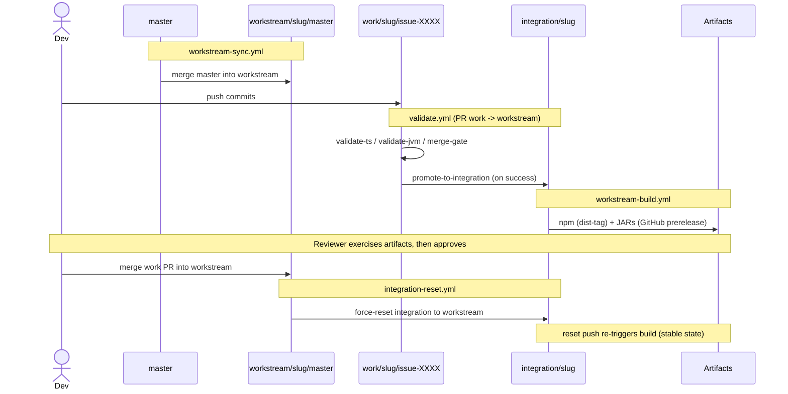

# Workstream Branch Architecture

A **workstream** is a parallel delivery lane for a multi-issue initiative. It gives the
initiative its own branch family and its own artifact build, so that related issues
integrate and get reviewed together — without blocking or polluting `master`.

Coday's workstreams produce **artifacts, not deployments**. There is no environment to
deploy to; the integration build publishes a coherent prerelease artifact set (npm packages
+ AgentOS JARs) that an external system downloads exactly as it downloads release artifacts
today.

---

## Branch taxonomy

| Branch type | Pattern | Example |
|---|---|---|
| Workstream | `workstream/<slug>/<base>` | `workstream/talent-portal/master` |
| Work | `work/<slug>/issue-XXXX-description` | `work/talent-portal/issue-0585-sync` |
| Integration | `integration/<slug>` | `integration/talent-portal` |

The `<slug>` is the workstream identifier and is shared by all three branch types.

> **The slug is semver-constrained.** It is embedded in a prerelease version identifier, so
> it MUST match `^[a-z0-9]+(-[a-z0-9]+)*$` — lowercase alphanumerics and single hyphens only.
> No underscores, no slashes, no dots. This is validated in CI; an invalid slug fails the
> promote job with an explicit message rather than surfacing later as an obscure npm error.

### `workstream/<slug>/<base>`

The shared integration point and the **PR target** for all work branches in the initiative.

- Tracks its base branch (normally `master`) via the **Workstream Sync** workflow.
- Never receives direct commits — only base syncs and merged work PRs.
- Does **not** trigger an artifact build directly (see *Why the build triggers on
  `integration/**` only*, below).

### `work/<slug>/issue-XXXX-description`

One developer's (or agent's) branch for one issue, within the initiative.

- Branched from `workstream/<slug>/<base>`, not from `master`.
- PR target is `workstream/<slug>/<base>`.
- Retains Coday's standard issue-number naming convention, prefixed with `work/<slug>/`.
  No base suffix — the workstream parent determines the base.
- On a passing PR validation, it is automatically promoted into `integration/<slug>`,
  which builds artifacts the reviewer can exercise **before** approving the merge.

> **Work branches are not auto-synced.** Unlike the upstream design this was adapted from,
> Coday does not push workstream updates into active work branches automatically. Coday's
> worktree workflow means agents are frequently mid-task in a worktree with a dirty tree;
> a bot push there is disruptive rather than helpful. Syncing is a manual
> `workflow_dispatch` instead.

### `integration/<slug>`

The mutable staging branch whose sole purpose is to produce reviewable artifacts.

- Receives automatic merges from work branches after each successful PR validation.
- Every push triggers **Workstream Build**, publishing a full prerelease artifact set.
- **Reset after each merge**: when a PR merges into `workstream/<slug>/<base>`, the branch
  is force-reset to the workstream head. This discards in-flight work that had been
  promoted but not yet merged (see *Known trade-off*, below).
- Its history is disposable. Never branch from it, never open a PR from it.

---

## Workflows

| Workflow | Trigger | Responsibility |
|---|---|---|
| `workstream-sync.yml` | push to `master` | Merge `master` into every `workstream/*/master` |
| `validate.yml` *(extended)* | PR into `master`, `hotfix/*`, `workstream/**` | Existing validation + `promote-to-integration` |
| `workstream-build.yml` | push to `integration/**` | Version, build, publish prerelease artifacts |
| `integration-reset.yml` | PR **merged** into `workstream/**` | Force-reset `integration/<slug>` to workstream head |

### Why the build triggers on `integration/**` only

The reset force-push *is itself* a push to `integration/**`. It therefore triggers a build
of the post-merge workstream state automatically. A separate build trigger on
`workstream/**` would be redundant and would double-publish the same tree under two
versions.

### Flow



---

## Versioning

Every integration build publishes the **complete** release set at one coherent prerelease
version:

Each build derives **two distinct identifiers**. They are routinely confused, so be precise:
the version is not the tag.

```
version:  0.241.1-talent-portal.4          tag:  workstream-talent-portal-4
          │       │             └── n                                   └── n
          │       └── workstream slug
          └── last release/X.Y.Z tag, patch incremented
```

`n` is a **per-workstream counter**: the build lists `refs/tags/workstream-<slug>-*`, takes the
highest numeric suffix, and increments. Each workstream therefore gets a clean `1, 2, 3, …`
independent of every other workstream.

Worked example: with `release/3.28.0` as the newest release tag, slug `forge`, and
`workstream-forge-3` as the highest existing forge tag — the version is **`3.28.1-forge.4`**
and the tag is **`workstream-forge-4`**.

- `3.28` — `major`.`minor` carried unchanged from `release/3.28.0`
- `.1` — `patch + 1`, incremented **unconditionally**
- `-forge` — slug, stripped from the `integration/forge` branch name
- `.4` / `-4` — per-slug counter, `3 + 1`

### Why a per-slug counter, not `GITHUB_RUN_NUMBER`

`GITHUB_RUN_NUMBER` is scoped to the **workflow file**, not the workstream. With two live
workstreams the sequences interleave — `forge.1`, `talent.2`, `forge.3`, `talent.4` — so each
workstream's own numbering is gappy and conveys nothing. Reading the counter back from the
slug's own tags gives each workstream a contiguous sequence, and makes the tag namespace
self-describing: `git tag --list 'workstream-forge-*'` is the complete, ordered build history
for that workstream.

### Why the tag omits the semver base but the version keeps it

The tag is `workstream-forge-4`, not `workstream-forge-3.28.1-forge.4`. Embedding the version
in the tag duplicated the slug and the counter for no gain.

The version **cannot** drop the base: npm requires valid semver, and
`scripts/utils/workstream-validators.ts` enforces the `X.Y.Z-<slug>.<n>` shape, failing the
build otherwise. The base is also genuinely informative — it records which release line the
workstream forked from. It is surfaced in the GitHub release title and notes, so omitting it
from the tag loses no discoverability.

### The tag is a reservation, pushed *before* publishing

The counter is read-modify-write over shared state, which makes ordering load-bearing:

1. **The tag is pushed immediately after the version is computed**, before any npm publish.
   If the tag were created at the end (as it was when the counter was `GITHUB_RUN_NUMBER`,
   which is collision-free by construction), a failure between the npm publish and the release
   creation would burn a version on npm while leaving no tag. The next run would recompute the
   *same* `n`, and npm would reject the publish — published versions are immutable. The
   pipeline would wedge until someone intervened manually.

   Pushing first makes the counter consumed at the moment it is computed. A failed build leaves
   a dangling tag with no release: cheap, self-evident, and strictly better than a poisoned
   counter.

2. **The `concurrency` group is now a correctness mechanism**, not merely a guard against
   partial artifact sets. Two concurrent builds on the same integration branch would read the
   same `n` and the second tag push would be rejected. Same-slug serialisation is what makes
   the read-modify-write atomic in practice. Builds for *different* slugs may safely overlap —
   they touch disjoint tag namespaces, exactly the property a per-slug counter has and
   `GITHUB_RUN_NUMBER` did not.

3. **`fetch-depth: 0` protects the counter, not just the release lookup.** A shallow clone
   makes the release lookup fail loudly, but would make the counter lookup silently reset to
   `1` and collide with an already-published npm version.

### Patch increment semantics

The patch increment makes no prediction about the next real release. If `master` subsequently
cuts `3.29.0`, this prerelease sorts below it — correct behaviour, since a prerelease is not a
promise about the next release version. Consumers install workstream artifacts by exact version
or by the `workstream-<slug>` dist-tag, never by semver range, so ordering relative to future
releases is irrelevant.

### Why the full set, never `nx affected`

`nx.json` defines a **single fixed release group** over `tag:platform:npm` and
`tag:platform:jvm`; `scripts/release.ts` releases everything under one `workspaceVersion`.
Consumers rely on that lockstep invariant — most visibly in
`libs/desktop-core/src/lib/coday-web-spec.ts`, where a packaged desktop app resolves its
server as `@whoz-oss/coday-web@<app.getVersion()>`, valid only because every artifact
shares a version.

Publishing a partial set would break that coherence. Integration builds therefore run
`nx run-many` across the whole set, including projects with no changes.

### Three inviolable rules

These are not stylistic preferences. Each one, if violated, causes damage that is silent at
the time and surfaces later somewhere unrelated.

**1. Never create a `release/*` tag.**
`nx.json` sets `releaseTag.pattern: release/{version}`, and version derivation finds the most
recent matching tag and walks conventional commits forward from it. A `release/*` tag created
by an integration build silently corrupts the *next real release on `master`*, which computes
its bump from the wrong baseline. Workstream tags live in a disjoint, **flat, dash-only**
namespace: `workstream-<slug>-<n>` — for example `workstream-forge-4`.

The flat form is deliberate. A hierarchical tag (`refs/tags/workstream/<slug>/<n>`) mirrors the
branch taxonomy in `refs/heads/workstream/<slug>/<base>`, which invites refname ambiguity and is
awkward to glob or pass to `gh release download`. The flat form supports
`git tag --list 'workstream-<slug>-*'` directly — which is also precisely how the build reads
its own counter back.

**2. Never run `releaseChangelog`.**
It commits version bumps and `CHANGELOG.md`, tags, and pushes. On an integration branch all
three are wrong, and the committed version bumps would then conflict on every subsequent base
sync from `master`. Workstream builds stamp versions in the working tree and never commit them.

**3. Never publish to the `latest` dist-tag.**
npm publishes use `--tag workstream-<slug>`. A prerelease moving `latest` is the single most
damaging failure mode available here — it would reach every consumer of the package.

### Artifact destinations

npm authentication uses **OIDC trusted publishing** (`id-token: write` + `registry-url` on
`setup-node` + `NPM_CONFIG_PROVENANCE`), exactly as `release.yml` does. There is no static npm
token in this repository — do not introduce a `NODE_AUTH_TOKEN` / `NPM_TOKEN` reference.

| Artifact | Destination |
|---|---|
| npm packages (`client`, `factory-cockpit`, `server`, `web`) | public npm, dist-tag `workstream-<slug>` |
| AgentOS JARs + `checksums.sha256` | GitHub **prerelease**, tag `workstream-<slug>-<n>` |
| JVM artifacts | GitHub Packages |
| Desktop installers | **not built** — `desktop` / `desktop-twin` already have no-op `nx-release-publish` |

The GitHub prerelease mirrors the asset layout of a normal release, so an external consumer
downloads workstream artifacts exactly as it downloads release artifacts. Prereleases are
marked `prerelease: true` so they never appear as "latest release".

---

## Merge policy

| PR | Merge strategy |
|---|---|
| `work/*` → `workstream/*` | **Squash** (standard Coday rule) |
| `workstream/*` → `master` | **Merge commit** — explicit exception |

### Why the exception exists

`nx release` derives both the version bump and the changelog from conventional commits on
`master`. Squashing a workstream into `master` would collapse a multi-issue initiative into a
*single* commit — one changelog entry, and one version bump derived from whichever type
happened to be in the PR title. A twelve-issue initiative would lose eleven issues' worth of
release history.

A merge commit preserves the individually-squashed per-issue commits, so `nx release` sees and
reports each one. This is the only sanctioned exception to Coday's mandatory-squash rule.

---

## Operational notes

### Cross-workflow pushes require `RELEASE_PAT`

Pushes made with the default `GITHUB_TOKEN` **do not trigger downstream workflows**. Every push
in this system is consumed by another workflow — sync feeds nothing directly, but promote and
reset both feed `workstream-build.yml`. Using `GITHUB_TOKEN` anywhere in the chain makes it
silently half-work: the push succeeds, the build never runs.

### Concurrency

**There is no `split()` function in GitHub Actions expressions.** The complete set is `contains`,
`startsWith`, `endsWith`, `format`, `join`, `toJSON`, `fromJSON`, `hashFiles`, plus the status
checks. An earlier version of this document prescribed `split(github.base_ref, '/')[1]`; that
was wrong and must not be reintroduced.

Because `concurrency` is evaluated *before any step runs*, a slug derived in a shell step is also
unavailable to it. A slug sitting mid-ref (`workstream/<slug>/master`, `integration/<slug>`)
therefore **cannot** be extracted to form a shared key. The actual groups are:

| Workflow | Expression | Resolves to (slug `forge`) |
|---|---|---|
| `validate.yml` (promote) | `workstream-${{ github.base_ref }}` | `workstream-workstream/forge/master` |
| `integration-reset.yml` | `workstream-${{ github.base_ref }}` | `workstream-workstream/forge/master` |
| `workstream-build.yml` | `workstream-${{ github.ref_name }}` | `workstream-integration/forge` |
| `workstream-repromote.yml` | `workstream-repromote-${{ inputs.work_branch }}` | `workstream-repromote-work/forge/…` |

Promote and reset **do** serialise with each other — the pairing that actually matters, since
both write the integration branch. Build and repromote serialise only against themselves.

If true cross-workflow serialisation ever becomes necessary, the options are to flatten the
branch taxonomy so the slug is a whole leading ref segment, or to route through `workflow_call`
passing the slug as an input so `inputs.slug` is directly usable in `concurrency.group`.

When reviewing any change here, write out the literal group string each workflow produces for
one concrete slug and confirm byte-equality. Do not trust an inline comment claiming they match.

`cancel-in-progress: false` everywhere. Cancelling a promote loses an artifact set; cancelling a
reset leaves the branch corrupt.

`workstream-sync.yml` is the exception: it uses a fixed `workstream-sync` group, since it
serialises only against itself and writes to no integration branch.

### The fork guard must be job-level, not step-level

A step-level `if` with `exit 0` only ends *that step* — every later step still runs, so the
checkout and push would proceed and fail with an opaque 403. The fork condition therefore belongs
in the **job-level `if`**:

```yaml
github.event.pull_request.head.repo.full_name == github.repository
```

A fork PR then shows as a cleanly *skipped* job rather than a failed one.

### Merge conflicts are signal, not noise

A promote that conflicts means two tickets in the initiative genuinely collide — which is
precisely what a workstream exists to surface early. The job must fail loudly and comment on
the PR. A silently-failed promote is the worst possible outcome: the reviewer then exercises an
artifact that does not contain the change under review.

### Base-sync conflicts on version files are rarer than they look — and MUST NOT be auto-resolved

`release.yml` rewrites `CHANGELOG.md`, every `apps/*/package.json` version field, and
`agentos/gradle/libs.versions.toml` on each release, so it is tempting to assume every sync from
`master` will conflict on those files and to add a blanket `.gitattributes` merge strategy.

**That assumption is wrong, and the mitigation is dangerous.**

Because of rule 2, the workstream branch **never commits version stamps** — integration builds
stamp versions in the working tree only. The version line in `apps/*/package.json` and the
`agentosSdk` / `agentosService` keys in `libs.versions.toml` are therefore *unmodified* on the
workstream side. Git merges line-by-line, not file-by-file, so a work branch that adds a
dependency to `package.json` merges cleanly with a master release that changed only the version
line. No conflict occurs.

A real conflict in these files means two sides genuinely changed overlapping lines — which is
information, not noise.

**Never auto-resolve these files at file level, in either direction:**

- `--ours` would freeze the workstream's version files at a stale release version, making the
  conflict recur and worsen on every subsequent sync.
- `--theirs` would discard legitimate work-branch edits elsewhere in the same file — a new
  dependency in `package.json`, a new library version in `libs.versions.toml`. Silent data loss.

`CHANGELOG.md` is the single exception: it is append-only and exclusively master-authored, so
`git checkout --theirs -- CHANGELOG.md` is safe there and nowhere else.

For everything else the sync must **fail loudly** and open an issue or notify, requiring manual
resolution.

### Known trade-off: reset discards in-flight promotions

When a PR merges, the reset wipes integration back to the workstream head — including *other*
work branches that were promoted but not yet merged. Those tickets disappear from the artifact
set until each re-promotes.

In a high-cadence repository this self-heals within minutes. At Coday's cadence it may not, so
`validate.yml` exposes a `workflow_dispatch` re-promote entry point allowing a developer to
restore their branch to integration without pushing a dummy commit.

---

---

## Implementation reference

Verified against nx `23.1.1` (`node_modules/nx/dist/src/command-line/release/`). These are the
non-obvious mechanics; see the inline rationale in each workflow for the rest.

### Version computation

```bash
# -v:refname applies semver ordering to the full refname.
# A plain lexicographic sort is WRONG: "release/0.9.0" > "release/0.241.0" lexicographically.
#
# --count=1 makes git itself do the limiting. Do NOT pipe to `head`.
LAST_TAG=$(git for-each-ref --count=1 --sort=-v:refname \
             --format='%(refname:short)' 'refs/tags/release/*')
if [ -z "$LAST_TAG" ]; then
  echo "ERROR: no release/* tags found — ensure the checkout uses fetch-depth: 0" >&2
  exit 1
fi
IFS='.' read -r major minor patch <<< "${LAST_TAG#release/}"

# Per-slug counter. The sed pattern anchors on a PURE-NUMERIC suffix, so legacy tags
# carrying a full version (workstream-forge-3.28.1-forge.3) contain dots, do not match,
# and are ignored — the migration to this scheme requires no tag cleanup.
#
# PIPE SAFETY: sed, sort and tail each consume their entire input before emitting, so
# none closes the pipe early. This is NOT the `| head -1` hazard described below.
LAST_N=$(git for-each-ref --format='%(refname:strip=2)' "refs/tags/workstream-${SLUG}-*" \
           | sed -n "s/^workstream-${SLUG}-\([0-9][0-9]*\)$/\1/p" \
           | sort -n | tail -1)
N=$(( ${LAST_N:-0} + 1 ))

VERSION="${major}.${minor}.$((patch + 1))-${SLUG}.${N}"
TAG="workstream-${SLUG}-${N}"
```

> **Never reintroduce `git tag --list 'release/*' --sort=-v:refname | head -1`.** An earlier
> version of this document prescribed exactly that, and it killed the first real workstream
> build with exit 141. `head -1` closes the pipe after one line, but `git tag --sort` must
> buffer and emit *all* matches; with 240+ `release/*` tags git writes into a closed pipe,
> takes SIGPIPE and exits 141. These workflows set `defaults.run.shell: bash`, which GitHub
> expands to `bash --noprofile --norc -eo pipefail {0}` — note `pipefail`, which the implicit
> Linux default (`bash -e {0}`) does **not** set. Under `pipefail` the SIGPIPE becomes the
> pipeline's exit status and `-e` kills the step. `%(refname:short)` yields `release/3.28.0`,
> byte-identical to `git tag --list` output, so downstream `${LAST_TAG#release/}` is unaffected.
>
> A secondary lesson: the `-z "$LAST_TAG"` guard above never ran — `set -e` killed the script
> one line earlier. Under `-e`, validate the *exit status* of the producing command, not only
> the emptiness of its result.

`fetch-depth: 0` is mandatory. `filter: tree:0` is fine — partial clone affects blob/tree
fetching, not tags.

### nx programmatic API

The no-commit / no-tag prerelease flow is a supported path, not a workaround:

- `releaseVersion({ specifier: '0.241.0-talent-portal.47' })` stamps every `package.json` with
  that exact string. All git operations are guarded by `args.gitCommit ?? config.version.git.commit`,
  and `nx.json` already sets `commit: false` / `tag: false`. Nothing is committed, tagged, staged,
  or pushed.
- Passing a `specifier` **skips conventional-commit resolution entirely**, so
  `conventionalCommits: true` in `nx.json` does not interfere.
- `releasePublish({ tag })` forwards to `npm publish --tag`. This is the supported mechanism for
  the `workstream-<slug>` dist-tag.
- JVM projects have a no-op `nx-release-publish` target, so `releasePublish` exits 0 for them
  without publishing. JVM artifacts go through the Gradle `publish` target, exactly as on master.

### Script structure

Extract a shared `scripts/utils/release-steps.ts` exposing `stampVersion(exactVersion, dryRun)`
and `publishPackages(releaseGraph, versionData, distTag, dryRun)`. `stampVersion` owns the
`updateTomlVersions` call, which must run after version computation and before any publish.

- `scripts/release.ts` (master) — keeps `releaseChangelog()`, which is **never shared**.
- `scripts/workstream-release.ts` — takes `--version` and `--slug`, calls the two shared
  functions, and never imports `releaseChangelog`. That omission is the entire safety guarantee.

### Promote job specifics

- Slug comes from `github.base_ref`; cross-check it against the slug in `github.head_ref` and fail
  with a PR comment on mismatch (a `work/foo/*` PR targeting `workstream/bar/master` is a user
  error).
- If `integration/<slug>` does not exist, **create it** from the workstream head rather than
  failing. Requiring manual setup before the first PR is friction without safety benefit.
- Requires `permissions: contents: write` and `pull-requests: write`.
- **Fork guard**: `pull_request` events from forks have no secrets and no write permission, so the
  promote would fail obscurely. Detect
  `github.event.pull_request.head.repo.full_name != github.repository` and skip with a clear
  message. We deliberately do *not* use `pull_request_target`, which would run fork-authored code
  with full secret access.

### `agentos-service` JAR naming

`bootJar` forces `archiveFileName = agentos-service.jar` with no version. The workstream upload
must replicate the rename to `agentos-service-<version>.jar` that `release.yml` performs, to
preserve the `<artifactId>-<version>.jar` contract consumers rely on.

---

## Lifecycle

**Starting an initiative**
1. Choose a slug matching `^[a-z0-9]+(-[a-z0-9]+)*$`.
2. Create `workstream/<slug>/master` from `master`.
3. Create `integration/<slug>` from the workstream branch.

**Working an issue**
1. Branch `work/<slug>/issue-XXXX-description` from the workstream branch.
2. Open a PR targeting `workstream/<slug>/master`.
3. On green CI, artifacts build automatically; the reviewer exercises them.
4. Squash-merge into the workstream. Integration resets and rebuilds.

**Closing an initiative**
1. Open a PR from `workstream/<slug>/master` to `master`.
2. **Merge commit** — not squash.
3. Delete all three branches. Optionally deprecate the npm dist-tag.
