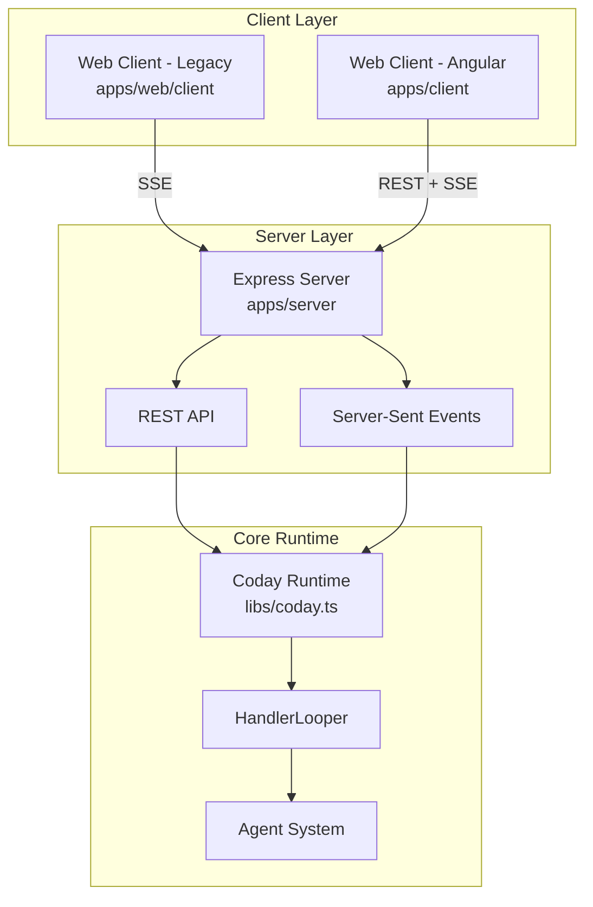
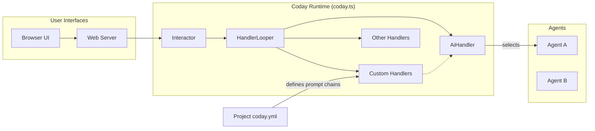
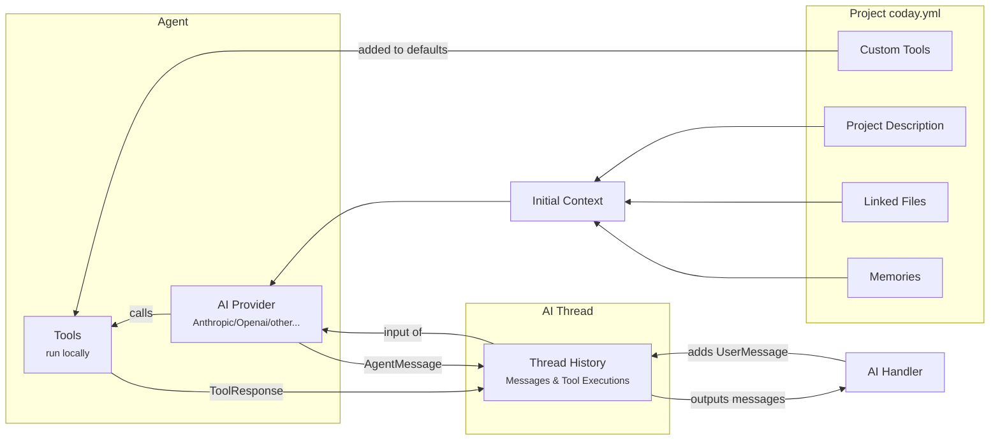
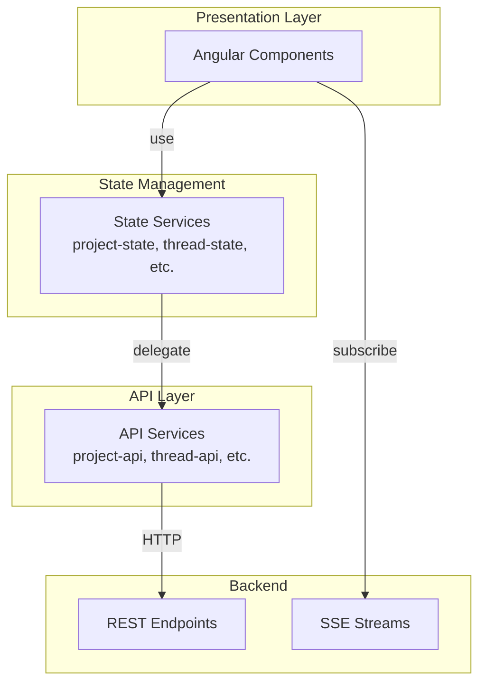

# Architecture Overview

Coday follows a hybrid architecture with multiple client interfaces (terminal, web) connecting to a shared backend runtime.

## System Architecture



### Client Interfaces

**Web Client - Legacy** (`apps/web/client`)
- Manual JavaScript/HTML/CSS implementation
- SSE (Server-Sent Events) for real-time updates
- Being gradually replaced by Angular client

**Web Client - Angular** (`apps/client`)
- Modern Angular 18 application
- REST API for CRUD operations
- SSE for event streaming (messages, tool calls)
- Service layer architecture (API + State services)
- Currently in active development

### Server Layer

The Express server (`apps/server`) provides:
- **REST API**: Thread, project, file, and configuration management
- **SSE Endpoints**: Real-time event streaming per thread
- **Thread-based Coday instances**: Each thread has its own Coday runtime instance
- **Authentication**: Username extraction from headers (proxy-based auth)

## Request Flow

The user request flows through Coday's components:

1. The User Interface components connect to an `Interactor` that exposes downstream interactions with the user
2. The `HandlerLooper` identifies the correct handler to take the user request among several ones. The last one being the `AiHandler` that directs the request to an agent
3. The selected `Agent` has through its supporting `AiClient` a loop of its own so the agent can come to a final answer after possibly many intermediate messages and tool calls (that can be nested agent calls)

For detailed information about backend handler design patterns and implementation guidelines, see [Handler Design](HANDLER_DESIGN.md).



## Agent Operation

An AI agent processes a request using various data sources and tools:



The agent operation demonstrates how requests are processed within an agent:

1. Context Building:
   - Project configuration provides description, files, and memories
   - These form the initial context for the AI provider
   - Custom tools are added to the default toolset

2. Message Processing:
   - AI Handler adds user messages to the thread history
   - Thread history provides full context to the AI provider
   - AI provider can generate messages and use tools
   - Tool responses and agent messages are recorded in history
   - History outputs messages back to the AI Handler

3. Tool Execution:
   - Tools run locally in the system
   - Each tool execution is recorded in history
   - AI provider can make multiple tool calls
   - Results influence further agent responses

## Frontend Architecture (Angular Client)

The new Angular client (`apps/client`) follows a layered service architecture:



### Service Architecture Pattern

Coday's Angular frontend follows a strict separation between API and State services:

**API Services** (`*-api.service.ts`)
- Pure HTTP layer
- 1:1 mapping to backend REST endpoints
- Return Observable<T> for reactive consumption
- No business logic or state management
- Example: `ProjectApiService`, `ThreadApiService`, `MessageApiService`

**State Services** (`*-state.service.ts`)
- Business logic and state management
- Use BehaviorSubject/Signal for reactive state
- Inject and coordinate API services
- Provide high-level methods for components
- Handle validation and error scenarios
- Example: `ProjectStateService`, `ThreadStateService`

**Component Usage**
- Components ALWAYS use State services
- Components NEVER call API services directly
- This ensures consistent business logic and state management

### Example: Thread Management

```typescript
// Backend route
POST /api/projects/:projectName/threads/:threadId/stop

// Frontend API Service (pure HTTP)
class ThreadApiService {
  stopThread(projectName: string, threadId: string): Observable<Response> {
    return this.http.post(`/api/projects/${projectName}/threads/${threadId}/stop`, {})
  }
}

// Frontend State Service (business logic)
class ThreadStateService {
  stop(): void {
    const projectName = this.projectState.getSelectedProjectId()
    const threadId = this.selectedThreadId
    
    if (!projectName || !threadId) {
      console.error('Cannot stop: no project or thread selected')
      return
    }
    
    this.threadApi.stopThread(projectName, threadId).subscribe({
      next: () => console.log('Stop signal sent'),
      error: (err) => console.error('Error:', err)
    })
  }
}

// Component usage
class ThreadComponent {
  constructor(private threadState: ThreadStateService) {}
  
  onStopClick() {
    this.threadState.stop() // ✅ Use state service
  }
}
```

### Real-Time Updates

The Angular client uses Server-Sent Events (SSE) for real-time updates:

```typescript
// EventStreamService subscribes to SSE endpoint
GET /api/projects/:projectName/threads/:threadId/event-stream

// Emits CodayEvent instances:
// - MessageEvent (user/assistant messages)
// - ToolRequestEvent / ToolResponseEvent (tool usage)
// - ThinkingEvent (processing indicator)
// - FileEvent (file operations)
// - InviteEvent / ChoiceEvent (user input requests)
```

Components subscribe to `EventStreamService.events$` to react to real-time updates.

### File Exchange Architecture

The file exchange system demonstrates the service architecture:

```
FileExchangeDrawerComponent
  ↓ uses
FileExchangeStateService (business logic)
  ↓ delegates to
FileExchangeApiService (HTTP calls)
  ↓ calls
REST API endpoints (/api/projects/:project/threads/:thread/files)
```

**Features**:
- File upload with drag & drop
- Real-time file list updates via FileEvent
- Content viewer with format-specific rendering (markdown, JSON, YAML, HTML)
- Download and delete operations

**Supported Formats**:
- Markdown → Rendered HTML
- JSON → Formatted with indentation
- YAML → Monospace display
- HTML → Sandboxed iframe
- Text → Plain text display

### Route Guards

The Angular client uses functional route guards to synchronize state with URL parameters:

```typescript
// Ensures ProjectStateService is updated before component activation
export const projectStateGuard: CanActivateFn = (route) => {
  const projectState = inject(ProjectStateService)
  const projectName = route.params['projectName']
  return projectState.selectProject(projectName)
}
```

Guards execute before component activation, ensuring state consistency for deep links.

## Data Flow Patterns

### Web Client (Angular)
```
User Action → Component → State Service → API Service → REST Endpoint → Coday Runtime
                                                                              ↓
Component ← EventStreamService ← SSE ← Events ← Agent/Tools ← Coday Runtime
```

### Thread-based Architecture

Each conversation thread has:
- Unique thread ID
- Dedicated Coday runtime instance (via ThreadCodayManager)
- Isolated file exchange space
- Independent message history
- Separate SSE connection

Multiple users can connect to the same thread (future capability), with each maintaining their own SSE connection to the shared Coday instance.
