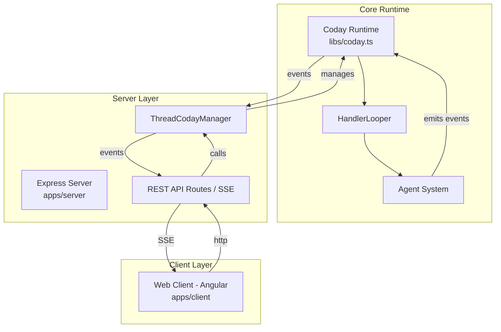
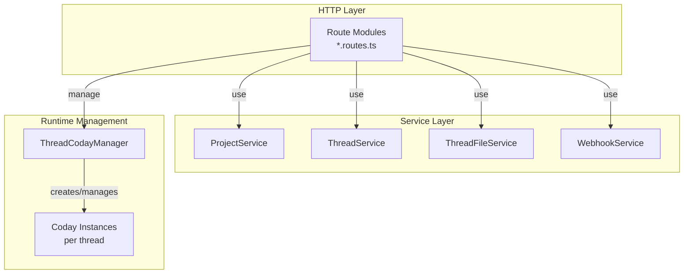
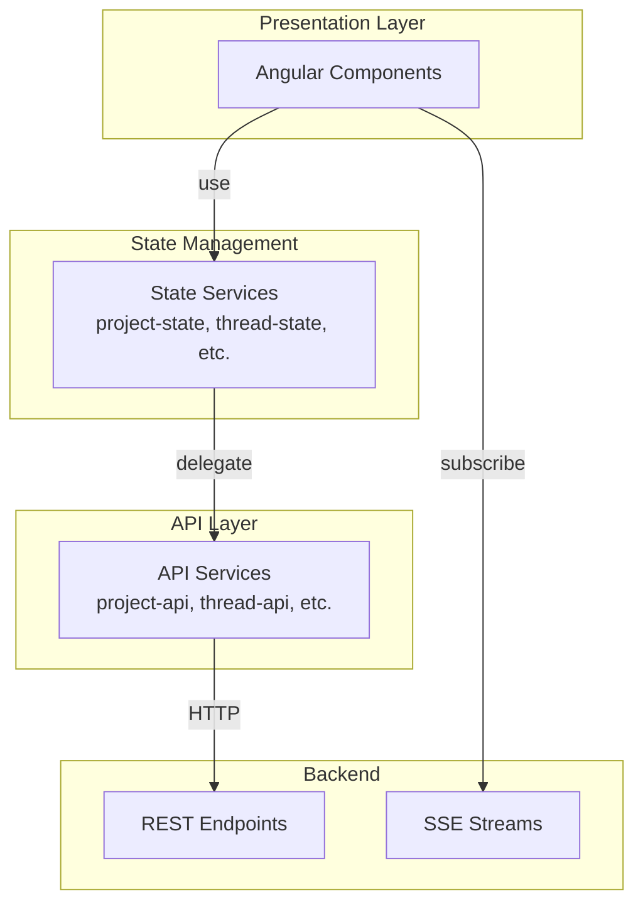
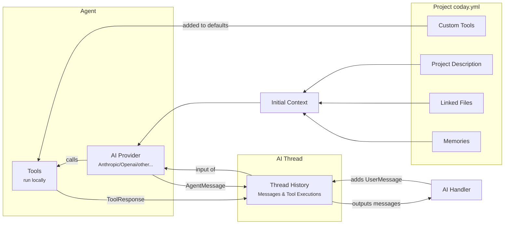

# Architecture Overview

Coday is a web-based AI agent system built with Angular frontend and Express backend, connected through REST API and Server-Sent Events (SSE).

## System Architecture



### Architecture Layers

**Web Client** (`apps/client`)
- Angular application with TypeScript
- REST API for commands (CRUD operations)
- SSE for real-time event streaming
- Service layer architecture (API + State services)

**Server Layer** (`apps/server`)
- Express.js HTTP server
- REST API routes for resource management
- SSE endpoints for event streaming
- ThreadCodayManager for runtime lifecycle
- Authentication via proxy headers

**Core Runtime** (`libs/`)
- Coday runtime with handler system
- Agent orchestration and AI provider integration
- Tool execution and event emission
- Thread-based conversation management

## Server Architecture (Express Backend)

The Express server (`apps/server`) provides the bridge between web clients and Coday runtime instances.



### Route Organization Pattern

Server routes are organized by domain entity, following REST conventions:

**Route Modules** (`apps/server/src/*.routes.ts`)
- `project.routes.ts` - Project CRUD and listing
- `thread.routes.ts` - Thread CRUD, file operations, SSE
- `message.routes.ts` - Message operations (delete, truncate)
- `config.routes.ts` - User and project configuration
- `webhook.routes.ts` - Webhook CRUD and triggering

**Pattern**:
```typescript
export function registerThreadRoutes(
  app: express.Application,
  threadService: ThreadService,
  threadFileService: ThreadFileService,
  threadCodayManager: ThreadCodayManager,
  getUsernameFn: (req) => string,
  codayOptions: CodayOptions
): void {
  // Define routes
  app.get('/api/projects/:projectName/threads', async (req, res) => { /* ... */ })
  app.post('/api/projects/:projectName/threads', async (req, res) => { /* ... */ })
  // ... more routes
}
```

### Service Layer Pattern

Services encapsulate business logic and data persistence:

**Service Responsibilities**:
- Data validation and sanitization
- File system operations (project/thread storage)
- Thread metadata management (name, dates, starring)
- User-specific data filtering
- Error handling and logging

**Example - ThreadService**:
```typescript
class ThreadService {
  async listThreads(projectName: string, username: string): Promise<ThreadInfo[]>
  async createThread(projectName: string, username: string, name?: string): Promise<Thread>
  async getThread(projectName: string, threadId: string): Promise<Thread | null>
  async updateThread(projectName: string, threadId: string, updates: Partial<Thread>): Promise<Thread>
  async deleteThread(projectName: string, threadId: string): Promise<boolean>
  async starThread(projectName: string, threadId: string, username: string): Promise<Thread>
  async unstarThread(projectName: string, threadId: string, username: string): Promise<Thread>
}
```

### ThreadCodayManager Pattern

**Purpose**: Manages lifecycle of thread-specific Coday runtime instances.

**Key Responsibilities**:
- Create Coday instance per thread (lazy initialization)
- Manage SSE connections (multiple clients can connect to same thread)
- Handle instance timeouts and cleanup
- Send heartbeat events to keep connections alive
- Coordinate between REST API calls and runtime instances

**Instance Lifecycle**:
```typescript
class ThreadCodayManager {
  // Get or create instance for thread
  getOrCreate(threadId, projectName, username, options, sseResponse): ThreadCodayInstance
  
  // Create without SSE (for webhooks)
  createWithoutConnection(threadId, projectName, username, options): ThreadCodayInstance
  
  // Get existing instance
  get(threadId): ThreadCodayInstance | null
  
  // Stop execution
  stop(threadId): void
  
  // Cleanup and shutdown
  async shutdown(): Promise<void>
}
```

**Timeout Management**:
- **Disconnect timeout** (5 min): Window for client reconnection
- **Interactive inactivity** (8 hours): Long-idle session cleanup
- **Oneshot inactivity** (30 min): Webhook session cleanup

**Heartbeat Mechanism**:
- Global 30-second interval
- Sends HeartBeatEvent to all instances with active SSE connections
- Keeps connections alive through proxies/load balancers

### REST API Patterns

**Resource Hierarchy**:
```
/api/projects/:projectName
  /threads
  /threads/:threadId
  /threads/:threadId/files
  /threads/:threadId/files/:filename
  /threads/:threadId/stop
  /threads/:threadId/star
  /threads/:threadId/event-stream (SSE)
```

**Standard CRUD**:
- `GET` - List or retrieve resource
- `POST` - Create resource or trigger action
- `PUT` - Update resource
- `DELETE` - Remove resource

**Authentication**:
- Username extracted from `x-forwarded-email` header (set by auth proxy)
- `getUsernameFn(req)` provides username to all routes
- Services filter data by username for multi-tenancy

**Validation**:
- Path parameters validated (projectName, threadId, filename)
- Request body validated (required fields, types)
- File operations include security checks (path traversal prevention)
- Error responses with appropriate HTTP status codes

### SSE (Server-Sent Events) Pattern

**Endpoint**: `GET /api/projects/:projectName/threads/:threadId/event-stream`

**Connection Flow**:
```typescript
app.get('/api/.../event-stream', async (req, res) => {
  // 1. Validate authentication and parameters
  // 2. Setup SSE headers
  res.setHeader('Content-Type', 'text/event-stream')
  res.setHeader('Cache-Control', 'no-cache')
  res.setHeader('Connection', 'keep-alive')
  
  // 3. Get or create thread instance
  const instance = threadCodayManager.getOrCreate(threadId, projectName, username, options, res)
  
  // 4. Handle client disconnect
  req.on('close', () => {
    threadCodayManager.removeConnection(threadId, res)
  })
  
  // 5. Start Coday if new instance
  instance.startCoday()
})
```

**Event Emission**:
- Coday runtime emits CodayEvents (MessageEvent, ToolRequestEvent, etc.)
- ThreadCodayManager broadcasts events to all connected SSE clients
- Events formatted as SSE protocol: `data: ${JSON.stringify(event)}\n\n`

**Event Types**:
- `MessageEvent` - User and assistant messages
- `ToolRequestEvent` / `ToolResponseEvent` - Tool usage
- `ThinkingEvent` - Processing indicator
- `FileEvent` - File operations (created, updated, deleted)
- `InviteEvent` / `ChoiceEvent` - User input requests
- `HeartBeatEvent` - Keep-alive signal

### File Operations Pattern

**ThreadFileService** manages thread-specific file storage:

```typescript
class ThreadFileService {
  async saveFile(projectName, threadId, filename, buffer): Promise<void>
  async listFiles(projectName, threadId): Promise<FileInfo[]>
  async getFilePath(projectName, threadId, filename): Promise<string>
  async deleteFile(projectName, threadId, filename): Promise<void>
}
```

**Security**:
- Path traversal prevention (filename validation)
- File size limits (20 MB)
- Allowed extensions check
- User ownership verification via thread service

**Integration with Runtime**:
- Upload endpoint saves file + sends notification message to Coday
- Agent uses `readFile` tool to access files
- FileEvent emitted on file operations for real-time UI updates

## Frontend Architecture (Angular Client)

The Angular client (`apps/client`) follows a layered service architecture:



### Service Architecture Pattern

Coday's Angular frontend follows a strict separation between API and State services:

**API Services** (`*-api.service.ts`)
- Pure HTTP layer
- 1:1 mapping to backend REST endpoints
- Return Observable<T> for reactive consumption
- No business logic or state management
- Example: `ProjectApiService`, `ThreadApiService`, `MessageApiService`

**State Services** (`*-state.service.ts`)
- Business logic and state management
- Use BehaviorSubject/Signal for reactive state
- Inject and coordinate API services
- Provide high-level methods for components
- Handle validation and error scenarios
- Example: `ProjectStateService`, `ThreadStateService`

**Component Usage**
- Components ALWAYS use State services
- Components NEVER call API services directly
- This ensures consistent business logic and state management

### Example: Thread Management

```typescript
// Backend route
POST /api/projects/:projectName/threads/:threadId/stop

// Frontend API Service (pure HTTP)
class ThreadApiService {
  stopThread(projectName: string, threadId: string): Observable<Response> {
    return this.http.post(`/api/projects/${projectName}/threads/${threadId}/stop`, {})
  }
}

// Frontend State Service (business logic)
class ThreadStateService {
  stop(): void {
    const projectName = this.projectState.getSelectedProjectId()
    const threadId = this.selectedThreadId
    
    if (!projectName || !threadId) {
      console.error('Cannot stop: no project or thread selected')
      return
    }
    
    this.threadApi.stopThread(projectName, threadId).subscribe({
      next: () => console.log('Stop signal sent'),
      error: (err) => console.error('Error:', err)
    })
  }
}

// Component usage
class ThreadComponent {
  constructor(private threadState: ThreadStateService) {}
  
  onStopClick() {
    this.threadState.stop() // ✅ Use state service
  }
}
```

### Real-Time Updates

The Angular client uses Server-Sent Events (SSE) for real-time updates:

```typescript
// EventStreamService subscribes to SSE endpoint
GET /api/projects/:projectName/threads/:threadId/event-stream

// Emits CodayEvent instances:
// - MessageEvent (user/assistant messages)
// - ToolRequestEvent / ToolResponseEvent (tool usage)
// - ThinkingEvent (processing indicator)
// - FileEvent (file operations)
// - InviteEvent / ChoiceEvent (user input requests)
// - HeartBeatEvent (keep-alive)
```

Components subscribe to `EventStreamService.events$` to react to real-time updates.

### File Exchange Architecture

The file exchange system demonstrates the service architecture:

```
FileExchangeDrawerComponent
  ↓ uses
FileExchangeStateService (business logic)
  ↓ delegates to
FileExchangeApiService (HTTP calls)
  ↓ calls
REST API endpoints (/api/projects/:project/threads/:thread/files)
```

**Features**:
- File upload with drag & drop
- Real-time file list updates via FileEvent
- Content viewer with format-specific rendering (markdown, JSON, YAML, HTML)
- Download and delete operations

**Supported Formats**:
- Markdown → Rendered HTML
- JSON → Formatted with indentation
- YAML → Monospace display
- HTML → Sandboxed iframe
- Text → Plain text display

### Route Guards

The Angular client uses functional route guards to synchronize state with URL parameters:

```typescript
// Ensures ProjectStateService is updated before component activation
export const projectStateGuard: CanActivateFn = (route) => {
  const projectState = inject(ProjectStateService)
  const projectName = route.params['projectName']
  return projectState.selectProject(projectName)
}
```

Guards execute before component activation, ensuring state consistency for deep links.

## Request Flow

User interactions flow through the system in this sequence:

### User Action Flow
```
1. User Action (UI)
   ↓
2. Angular Component
   ↓
3. State Service (validation, business logic)
   ↓
4. API Service (HTTP call)
   ↓
5. Express Route (REST endpoint)
   ↓
6. Service Layer (data operations)
   ↓
7. ThreadCodayManager (runtime coordination)
   ↓
8. Coday Runtime (handler selection)
   ↓
9. Agent (AI processing, tool calls)
```

### Event Flow (Real-Time Updates)
```
1. Agent/Tool (generates event)
   ↓
2. Coday Runtime (emits CodayEvent)
   ↓
3. ThreadCodayManager (broadcasts to SSE connections)
   ↓
4. SSE Endpoint (sends to clients)
   ↓
5. EventStreamService (parses events)
   ↓
6. Angular Components (subscribe and react)
   ↓
7. UI Update (display changes)
```

## Agent Operation

An AI agent processes a request using various data sources and tools:



The agent operation demonstrates how requests are processed within an agent:

1. **Context Building**:
   - Project configuration provides description, files, and memories
   - These form the initial context for the AI provider
   - Custom tools are added to the default toolset

2. **Message Processing**:
   - AI Handler adds user messages to the thread history
   - Thread history provides full context to the AI provider
   - AI provider can generate messages and use tools
   - Tool responses and agent messages are recorded in history
   - History outputs messages back to the AI Handler

3. **Tool Execution**:
   - Tools run locally in the system
   - Each tool execution is recorded in history
   - AI provider can make multiple tool calls
   - Results influence further agent responses

For detailed information about handler design patterns and implementation guidelines, see [Handler Design](HANDLER_DESIGN.md).

## Thread-Based Architecture

Each conversation thread has its own isolated runtime:

**Thread Components**:
- **Unique thread ID**: UUID-based identifier
- **Dedicated Coday instance**: Via ThreadCodayManager
- **Isolated file exchange space**: Thread-specific directory
- **Independent message history**: AiThread with full context
- **Separate SSE connections**: Multiple clients can connect

**Benefits**:
- **Isolation**: Threads don't interfere with each other
- **Scalability**: Multiple threads can run concurrently
- **Reconnection**: Clients can reconnect to existing threads
- **Collaboration**: Multiple users can join same thread (future)

**Lifecycle**:
1. Thread created via REST API (`POST /threads`)
2. Client connects via SSE (`GET /threads/:id/event-stream`)
3. ThreadCodayManager creates or retrieves Coday instance
4. User interactions trigger agent processing
5. Events stream back to connected clients
6. Thread persists until timeout or deletion

## Data Persistence

**Project Structure** (`~/.coday/projects/:projectName/`):
```
project-name/
├── project.yml          # Project configuration
├── threads/
│   ├── thread-id-1.yml  # Thread metadata + messages
│   ├── thread-id-2.yml
│   └── thread-id-2/
│       ├── file-1/      # Thread-specific files
│       └── file-2/
```

**Thread Storage**:
- YML files with thread metadata and message history
- File attachments in separate subdirectory named as per the thread
- Automatic save on message addition
- Lazy loading on thread access

**Configuration Storage**:
- User config: `~/.coday/users/:username/user.yml`
- Project config: `~/.coday/projects/:projectname/project.yml`
- Three-level hierarchy: CODAY → PROJECT → USER

## Security Considerations

**Authentication**:
- Proxy-based authentication (x-forwarded-email header)
- No authentication in development mode (uses system username)
- Username-based data isolation

**File Operations**:
- Path traversal prevention
- Filename sanitization
- File size limits (20 MB)
- Extension whitelist
- User ownership verification

**API Security**:
- Input validation on all endpoints
- Error messages without sensitive details
- Proper HTTP status codes
- CORS configuration for web client

## Performance Optimizations

**Agent System**:
- Lazy loading of agents (only created on first use)
- Agent definition caching
- Tool pre-initialization in parallel

**AI Provider Caching** (Anthropic):
- Mobile cache marker strategy (70/40 thresholds)
- Tool definition caching
- System instruction caching
- Automatic cache invalidation

**Rate Limiting**:
- Proactive throttling based on remaining capacity
- Automatic retry with exponential backoff
- Age-based decay to prevent permanent throttling

**Thread Management**:
- Automatic cleanup of idle threads
- Heartbeat mechanism for connection health
- Graceful shutdown on system sleep/wake

## Error Handling

**Backend**:
- Try-catch blocks around all async operations
- Proper error logging with context
- HTTP error responses with appropriate status codes
- Graceful degradation on service failures

**Frontend**:
- RxJS catchError operators in all API calls
- User-friendly error messages
- Automatic reconnection for SSE
- Loading and error states in UI

**System Resilience**:
- Sleep mode support (proper signal handling)
- RxJS EmptyError handling for system interruptions
- Connection timeout recovery
- Defensive programming for data validation
