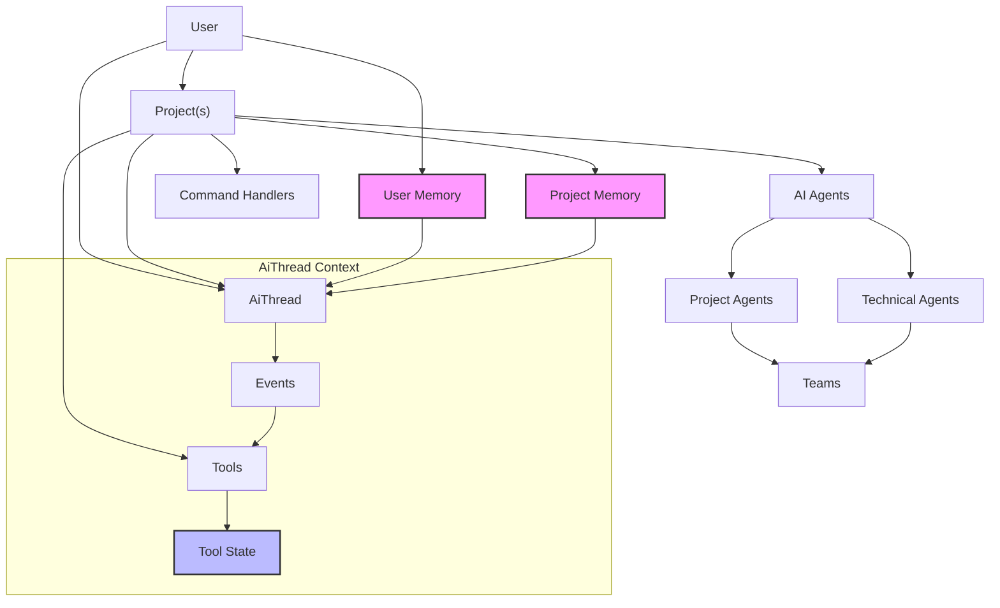

# Domain Model

## Core Concepts

### User

The User represents either a human developer or a technical account running Coday. They are identified by a unique
username and:

- Have their own configuration preferences
- Can access one or more projects
- Own personal memories that influence AI interactions
- Control integrations through their API keys and credentials

Key characteristics:

- Persistent preferences and settings
- Personal memory bank
- Integration credentials
- Command history

### Project

A Project defines the operational context for Coday, encompassing:

- Configuration of available AI agents and their capabilities
- Definition of available tools and their parameters
- Command handlers for specific project needs
- Shared knowledge base and memory bank
- Integration settings specific to the project

Key aspects:

- Provides contextual boundaries
- Defines available capabilities
- Maintains project-specific memory
- Configures integration points
- Sets up development environment context

### AiThread

An AiThread represents an ongoing interaction context between User and Agents. It:

- Maintains its own event history
- Manages token limits for AI context
- Tracks file and tool states
- Provides optimized views of its history
- Ensures continuity of conversation
- Maintains agent-specific state in thread scope
- Supports multi-agent interaction patterns

Key characteristics:

- Self-contained interaction space
- Agent-agnostic state management
- History optimization
- Context window management
- Tool state tracking

AiThreads are to be forked, cloned, and re-worked for use by technical agents and project agents. Yet, only the main
AiThread holds only project agents contributions.

### Events

Events are atomic units of interaction that flow through the system. Types include:

- User inputs and AI responses
- Tool requests and their results
- System state changes
- Error conditions
- Configuration changes

Key aspects:

- Carry full context
- AiThread-scoped
- Immutable
- Sequential
- Traceable

### Tools

Tools are defined capabilities that allow AI to interact with the environment:

- File system operations
- Git commands
- Integration APIs
- System commands
- Memory operations

Characteristics:

- Stateless implementation
- AiThread-managed state
- Clear input/output contract
- Error handling patterns
- Documentation requirements

### Integration

An Integration represents a group of related tools and configurations that enable interaction with external systems:

- API configuration (URL, credentials)
- Related tool definitions
- Specific handlers if needed
- Error handling patterns

Key aspects:

- Self-contained functionality
- Consistent configuration pattern
- Clear documentation requirements
- Specific error handling

### Handler Loop

The Handler Loop is the core command processing mechanism:

- Commands are queued in FIFO order
- Each command is matched against handlers sequentially
- First accepting handler processes the command
- Handlers can add new commands to the queue
- Unmatched commands default to AI handling

Characteristics:

- Sequential processing
- Dynamic command generation
- Command transformation
- Fallback mechanism

### Agent

An Agent represents an AI capability provider with specific configuration and purpose. Agents come in two categories:

1. Project Agents:
    - Explicitly configured in project settings
    - User-addressable through @agent-name syntax
    - Can belong to one or more teams
    - May be local or platform-based (e.g., OpenAI Assistants)
    - Domain-specific expertise and capabilities

2. Technical Agents:
    - Internal system agents not directly addressable
    - Perform specialized operations:
        * Memory curation
        * Context summarization
        * Team supervision
        * Inter-agent mediation
    - Support system patterns and operations

Key aspects:

- Clear capability boundaries
- Defined tool access levels
- Specific memory access patterns
- Implementation-specific state management for OpenAI Assistants
- Standard interface contract

### Team

A Team represents a group of Project Agents working together under Technical Agent supervision:

- Identified by #team-name syntax
- Static composition defined in project configuration
- Supervised by dedicated technical agents
- Collaborative problem-solving capabilities
- Shared context management

Key aspects:

- Clear team boundaries
- Supervised collaboration
- Unified response synthesis
- Context sharing patterns
- Role-based task distribution

### Memory

Memory represents the system's knowledge persistence:

- Project-level shared knowledge
- User-specific preferences and patterns
- Tool operation results

Key aspects:

- Hierarchical (Project/User)
- Contextual relevance
- Temporal validity
- Update mechanisms

## AgentOS Integration

**AgentOS** (Spring Boot + Kotlin) runs in parallel during transition:
- API proxy: `/api/agentos/*` → AgentOS backend
- Shared UI: `/agentos/` route with isolated components
- Generated clients: OpenAPI → Angular services

**Concept mapping**:
- Coday Project Agent → AgentOS Plugin Agent
- Coday Technical Agent → AgentOS Orchestrator
- Coday Tool → AgentOS Capability

## Domain Relationships

This graph shows how:

1. Users operate within Projects
2. Projects define available Tools and Agents
3. Threads provide interaction context
4. Memory exists at multiple levels
5. Tools maintain state within Threads
6. Events flow through AiThread context

The relationships emphasize:

- Clear ownership hierarchies
- Context boundaries
- State management responsibilities
- Memory access patterns
- Tool execution scopes