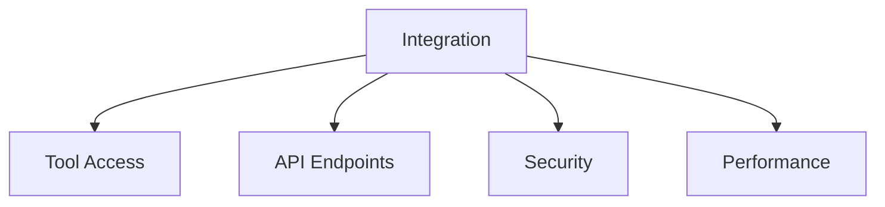
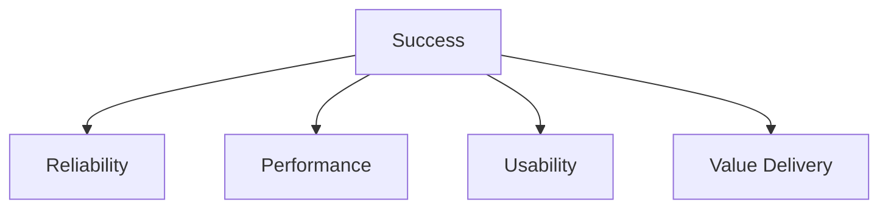

# Stakeholder Views

## Core Personas

### Software Developer

**Attributes**:

- Interaction: Complex to Continuous
- System Level: Tool Usage
- Context Depth: Technical/Deep

**Value Proposition**:
Accelerates development by providing immediate code understanding, documentation generation, and problem investigation.
Reduces context switching by keeping relevant project knowledge accessible. Assists in technical decisions by analyzing
implications of changes.

**Risks**:

- Over-reliance leading to reduced deep understanding
- Incomplete or outdated project context
- Token limits constraining complex analyses
- Tool limitations in specific technical domains

### Technical Integrator

**Attributes**:

- Interaction: Complex
- System Level: Extension/Setup
- Context Depth: Deep

**Value Proposition**:
Extends Coday's capabilities through new tool integration and API connections. Creates reusable patterns for common
operations and enables automation of complex tasks. Builds bridges between Coday and external systems.

**Risks**:

- Complex state management between tools
- Security implications of new integrations
- Maintenance burden of custom tools
- Integration testing complexity

### Process Owner

**Attributes**:

- Interaction: Recurrent
- System Level: API Integration
- Context Depth: Business

**Value Proposition**:
Automates parts of business workflows by integrating Coday's capabilities into existing processes. Enables consistent
handling of repetitive tasks while maintaining context awareness and error handling.

**Risks**:

- Dependency on Coday's availability
- Process synchronization issues
- Error handling complexity
- API version management

### System Administrator

**Attributes**:

- Interaction: Simple to Complex
- System Level: Setup/Monitoring
- Context Depth: Technical

**Value Proposition**:
Manages Coday deployment and configuration across teams. Ensures security compliance, monitors system health, and
maintains integration points. Controls resource usage and access patterns.

**Risks**:

- Configuration complexity
- Security policy enforcement
- Resource management
- User permission management

### Knowledge Worker

**Attributes**:

- Interaction: Simple to Recurrent
- System Level: Tool Usage
- Context Depth: Surface/Business

**Value Proposition**:
Processes business documents and data through integrated tools without needing technical expertise. Maintains
consistency in recurring tasks while adapting to variations in inputs and requirements.

**Risks**:

- Learning curve for optimal interaction
- Consistency of outputs
- Tool availability and limitations
- Data handling concerns

## Common Themes

### Integration Needs

### Success Factors

## Development Impact

These personas influence:

1. Feature Priority
    - Core tool reliability
    - Integration capabilities
    - Security measures
    - Performance optimization

2. Design Focus
    - Clear interaction models
    - Robust API design
    - Efficient state management
    - Error handling