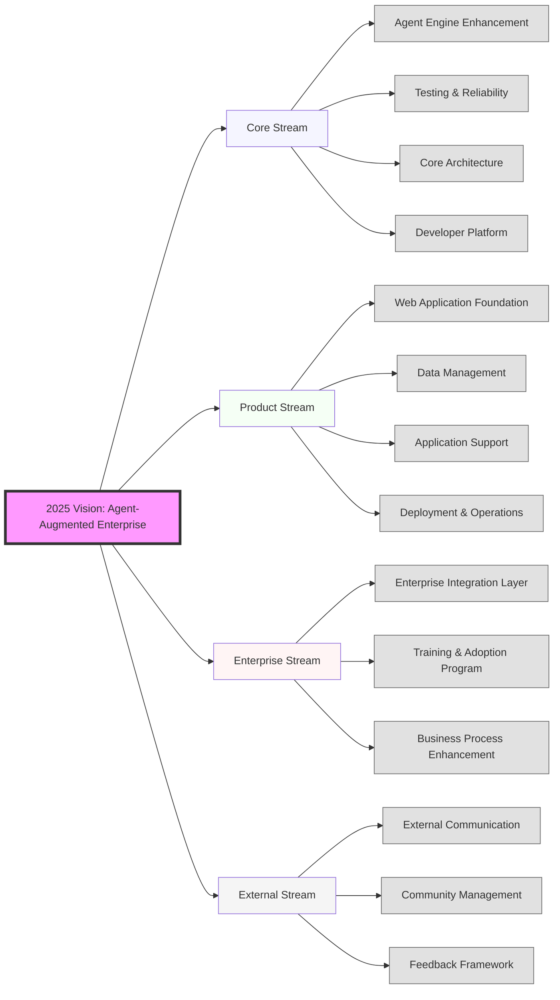

# Coday Roadmap 2025 🚀

## Vision
Transform our company into an agent-augmented workplace where every employee effectively leverages AI assistance through Coday, establishing us as a reference in enterprise agent adoption.

Each stream's branches represent their Key Implementations as defined in the roadmap.

## Streams

### Core Stream
**Intended Outcome**  
Deliver a robust, reliable agent engine that serves as the foundation for all Coday interactions, with a powerful terminal interface for technical users. The engine should handle complex agent interactions, tool management, and provide clear extension points for new capabilities.

**Success Metrics**  
- 100% of core features accessible through terminal
- Test corevage above 80% for core components
- All public APIs documented with examples
- Tool response time under 200ms (excluding AI processing)
- Support for 10+ concurrent agent conversations per project

**Key Implementations**  
1. Agent Engine Enhancement
   - Multi-modal document support framework (PDF, XLS, media)
   - Enhanced and shared memory and knowledge management system
   - Full multi-agent capability
   - Pluggable model architecture for easy AI provider addition

2. Testing & Reliability
   - Comprehensive test suite implementation
   - Performance monitoring and optimization framework
   - Automated regression testing system

3. Core Architecture
   - Proper clean architecture Core vs Rest_of_codebase
   - Integrations development SDK/lib
   - Standardized extension points for integrations
   - Pluggable to various "frontends": webapp, slack, teams, webhooks

4. Developer Platform
   - Comprehensive API documentation
   - SDK documentation and examples
   - Integration development guides
   - Testing framework documentation

**Required Resources**  
- ~1 full time equivalent developer: NodeJS, testing, extension modules. At least half man-power should be permanent, other part as timely contributions.

### Product Stream
**Intended Outcome**  
Provide a professional web application wrapping the core engine, with intuitive UI/UX for non-technical users, robust data management, and comprehensive documentation. The product should feel cohesive while maintaining the power and flexibility of the core.

**Success Metrics**  
- 100% of core capabilities exposed through web UI
- web UI accessibility
- User documentation covers 100% of features
- Data persistence with zero loss tolerance
- Frontend response time under 100ms for UI interactions (guessed threshold)
- Support for 10+ concurrent users per project on server installation
- Support for usage monitoring (MAU, errors, feedbacks)

**Key Implementations**  
1. Web Application Foundation
   - Complete UI/UX redesign for accessibility
   - Real-time collaboration features
   - Project/user management interface
   - Usage analytics dashboard

2. Data Management
   - MongoDB integration for scalable storage
   - Usage monitoring and reporting
   - Backup and restore capabilities
   - Data migration tools

3. Application Support
   - In-application help system
   - Error handling and user feedback
   - Feature discovery system

4. Deployment & Operations
    - Docker-based deployment system
    - Environment configuration tools
    - Auth layer implementation
    - Health monitoring

5. User self-help
    - Interactive setup wizard
    - Best practices and examples
    - User documentation and guides
    - Video tutorials and walkthroughs

**Required Resources**
- Frontend Developer contribution: ~0.5 FTE
- Backend Developer contribution: ~0.5 FTE
- UX Designer input: ~0.3 FTE
- Technical Writer for documentation: ~0.5 FTE
- DevOps support for deployment: ~0.3 FTE

### Enterprise Stream
**Intended Outcome**  
Drive company-wide adoption of Coday through targeted learning programs, use case development, and seamless integration with existing workflows. Establish Coday as the go-to tool for AI assistance across all departments.

**Success Metrics**  
- 100% of employees familiar with basic Coday usage
- Monthly active users reaching 80% of target departments
- Integration with 5+ key company workflows
- 30% reduction in time for common tasks through Coday usage (measure or survey)
- Token consumption indicating regular usage across departments (>1M tokens/user/month) 

**Key Implementations**  
1. Enterprise Integration Layer
   - Enhanced JIRA integration (backlog management, ticket workflows)
   - Slack bot implementation (primary chat interface)
   - Teams bot implementation (secondary chat interface)
   - Webhook system for business process integration
   - Custom department-specific tool development

2. Training & Adoption Program
   - Department champion program setup and management
   - Regular training sessions and workshops
   - Department-specific use case documentation
   - Success story collection and sharing
   - Usage analytics and adoption tracking
   - ROI measurement framework

3. Business Process Enhancement
   - Integration with product management workflows
   - Customer support integration patterns
   - Department-specific workflow templates
   - Impact measurement and reporting

**Required Resources**  
- Customer Success role: 0.75 FTE (covering training and support)
- Department champions: 0.1 FTE each from key departments (Product, Support, Sales)
- Integration developer: 0.25 FTE (for custom department tools)
- Training coordinator: 0.2 FTE (can be part of CS role)

### External Stream
**Intended Outcome**  
Enable autonomous adoption of Coday by external teams through comprehensive setup tools, documentation, and contribution guidelines. Focus on making Coday a reliable addition to existing development workflows while minimizing support needs.

**Success Metrics**
- Documentation covers 100% of setup scenarios
- Time to first agent interaction under 30 minutes
- 10+ external contributions received
- Support tickets below 2 per week per 100 users (guessed threshold)
- 5+ successful external team adoptions

**Key Implementations**  
1. External Communication
   - Social media presence (LinkedIn, Twitter/X)
   - Visual asset library (screenshots, diagrams, logos)
   - Presentation materials (slides, demos)
   - Customer success stories
   - Content calendar and posting schedule
   - Company collaboration framework
   - Conference and meetup materials

2. Community Management
   - Issue and PR templates
   - Community guidelines
   - Regular and automated release notes
   - Simple contribution guide focused on integrations

3. Feedback & Contribution Framework
   - Integration wishlist platform (users submit desired integrations)
   - Quarterly user feedback surveys
   - GitHub discussions for feature requests
   - Usage pattern analytics for priority insights

**Required Resources**  
- Marketing/Communication lead: 0.3 FTE (content creation, social media)
- Community manager: 0.2 FTE (GitHub, feedback processing)
- Content creator: 0.2 FTE (visual assets, presentations)
- Technical writer: 0.1 FTE (release notes, external communications)

## Dependencies & Synergies
1. Core → Product
   - API stability for web interface and other frontends
   - Developer platform must align with product needs
   - Performance and reliability requirements
   - Feature parity across interfaces (terminal, web, chat)

2. Core → Enterprise
   - Integration SDK powers department-specific tools
   - Multi-modal capabilities enable diverse use cases
   - Agent capabilities drive workflow automation

3. Product → Enterprise
   - UI/UX must support department-specific needs
   - User documentation feeds into training materials
   - Usage analytics inform adoption strategies

4. Enterprise → External
   - Success stories feed marketing content
   - Internal integrations become external examples
   - Department use cases inform external documentation

5. External → Product
   - Community feedback shapes product roadmap
   - Integration wishlist influences feature priority
   - Usage patterns inform UI/UX decisions

6. Cross-Stream
   - Documentation consistency across all levels
   - Coordinated release management
   - Shared quality standards
   - Resource optimization (especially technical writers)
   - Unified communication strategy

## Revision Strategy

### Quarterly Review Process
1. Q1 Review (April 2025)
   - Initial adoption metrics analysis
   - Early feedback collection
   - Resource allocation adjustment
   - Technical debt assessment

2. Q2 Review (July 2025)
   - Department coverage evaluation
   - Integration success measurement
   - Community growth assessment
   - Mid-year goals adjustment

3. Q3 Review (October 2025)
   - External adoption analysis
   - Resource optimization review
   - Feature completion check
   - Q4 priority alignment

4. Q4 Review (January 2026)
   - Year-end goals assessment
   - 2026 planning preparation
   - Success metrics evaluation
   - Resource planning for next year

### Review Components
- Stream leads monthly sync
- Quarterly all-hands review meeting
- Written progress reports
- Metrics dashboard review
- Resource utilization analysis
- Risk assessment and mitigation
- Goals and timeline adjustment

## Resource Summary

### Total FTE by Role
- Development: 2.25 FTE
  * Core Development: 1.0 FTE
  * Frontend Development: 0.5 FTE
  * Backend Development: 0.5 FTE
  * Integration Development: 0.25 FTE

- Product & Design: 0.6 FTE
  * UX Designer: 0.3 FTE
  * DevOps: 0.3 FTE

- Documentation & Content: 0.8 FTE
  * Technical Writers: 0.6 FTE (shared across streams)
  * Content Creator: 0.2 FTE

- Customer Success & Training: 0.95 FTE
  * Customer Success Lead: 0.75 FTE
  * Training Coordinator: 0.2 FTE

- Marketing & Community: 0.5 FTE
  * Marketing/Communication: 0.3 FTE
  * Community Management: 0.2 FTE

- Department Champions: ~0.3 FTE
  * 0.1 FTE from each key department (3 departments)

Total: ~5.4 FTE

### Key Observations
1. Development Focus
   - Largest allocation in development (41% of total)
   - Strong emphasis on core platform
   - Balanced frontend/backend split

2. Resource Optimization
   - Several shared roles across streams
   - Technical writers serving multiple streams
   - Flexible allocation possible for content creation

3. Critical Dependencies
   - Core development is the largest single allocation
   - Customer Success role critical for adoption
   - Department champions essential for internal buy-in

4. Potential Risks
   - Heavy reliance on part-time contributions
   - Multiple responsibilities for key roles
   - Need for effective coordination across shared resources

### Implementation Notes
- Phased resource onboarding recommended
- Some roles can start part-time and scale up
- Consider contractor support for specialized needs
- Regular resource allocation review needed
- Cross-training important for shared responsibilities
