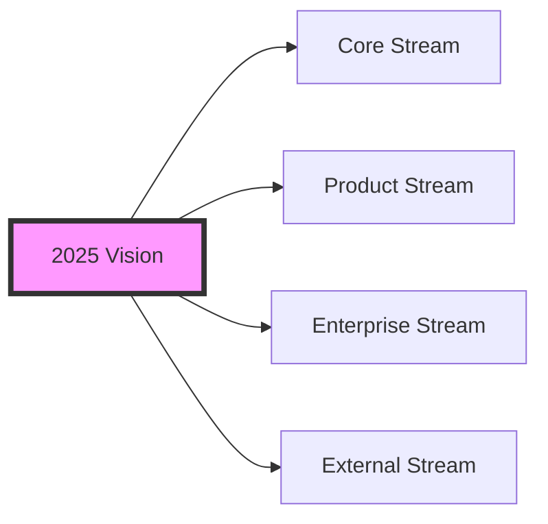

# Coday Roadmap 2025 🚀

## Vision
Transform our company into an agent-augmented workplace where every employee effectively leverages AI assistance through Coday, establishing us as a reference in enterprise agent adoption.

## Streams

### Core Stream
**Intended Outcome**  
Deliver a robust, reliable agent engine that serves as the foundation for all Coday interactions, with a powerful terminal interface for technical users. The engine should handle complex agent interactions, tool management, and provide clear extension points for new capabilities.

**Success Metrics**
- 100% of core features accessible through terminal
- Test coverage above 80% for core components
- All public APIs documented with examples
- Tool response time under 200ms (excluding AI processing)
- Support for 10+ concurrent agent conversations per user per project

**Key Implementations**  
[To be derived from metrics...]

**Required Resources**  
[To be derived from implementations...]

### Product Stream
**Intended Outcome**  
Provide a professional web application wrapping the core engine, with intuitive UI/UX for non-technical users, robust data management, and comprehensive documentation. The product should feel cohesive while maintaining the power and flexibility of the core.

**Success Metrics**  
- 100% of core capabilities exposed through web UI
- web UI accessibility
- User documentation covers 100% of features
- Data persistence with zero loss tolerance
- Frontend response time under 100ms for UI interactions (guessed threshold)
- Support for 10+ concurrent users per project on server installation
- Support for usage monitoring (MAU, errors, feedbacks)

**Key Implementations**  
[To be derived from metrics...]

**Required Resources**  
[To be derived from implementations...]

### Enterprise Stream
**Intended Outcome**  
Drive company-wide adoption of Coday through targeted learning programs, use case development, and seamless integration with existing workflows. Establish Coday as the go-to tool for AI assistance across all departments.

**Success Metrics**  
- 100% of employees familiar with basic Coday usage
- Monthly active users reaching 80% of target departments
- Integration with 5+ key company workflows
- 30% reduction in time for common tasks through Coday usage (measure or survey)
- Token consumption indicating regular usage across departments (>1M tokens/user/month) 

**Key Implementations**  
[To be derived from metrics...]

**Required Resources**  
[To be derived from implementations...]

### External Stream
**Intended Outcome**  
Enable autonomous adoption of Coday by external teams through comprehensive setup tools, documentation, and contribution guidelines. Focus on making Coday a reliable addition to existing development workflows while minimizing support needs.

**Success Metrics**
- Documentation covers 100% of setup scenarios
- Time to first agent interaction under 30 minutes
- 10+ external contributions received
- Support tickets below 2 per week per 100 users (guessed threshold)
- 5+ successful external team adoptions

**Key Implementations**  
[To be derived from metrics...]

**Required Resources**  
[To be derived from implementations...]

## Dependencies & Synergies
[To capture cross-stream dependencies and potential synergies...]

## Revision Strategy
- Quarterly review of outcomes vs metrics
- Resource reallocation based on stream progress
- Adaptation to emerging needs and opportunities

_Note: Several metrics include guessed thresholds/targets that should be reviewed and adjusted based on actual context and requirements._